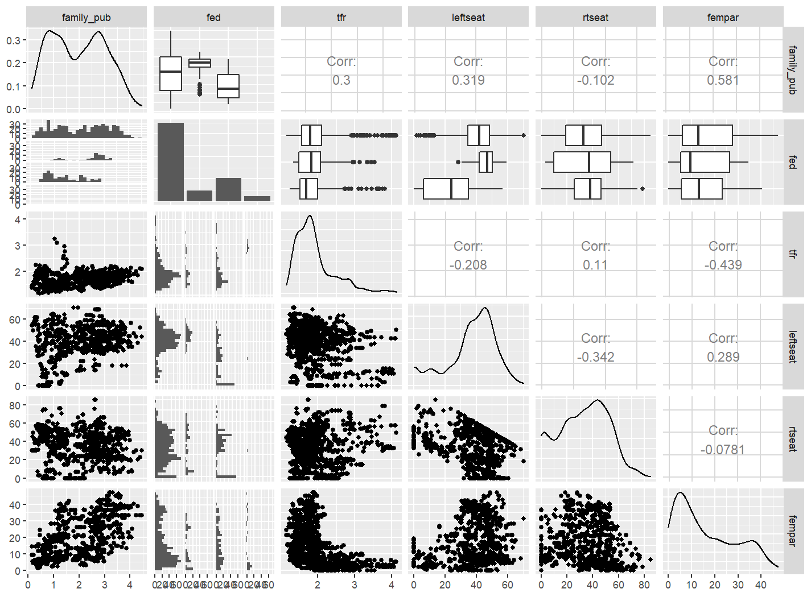

class: inverse, middle 
### Datenanalyse mit R
# # 11 Visuelle Darstellung mehrerer Variablen
### Tobias Wiß, Carmen Walenta und Felix Wohlgemuth
### 15.05.2020

---
# Daten für diese Woche
Wie in den letzten Wochen verwenden wir für diese Einheit die Daten des World Value Surveys Welle 6. Diese Woche erstellen wir aber unseren Datensatz direkt aus dem Welle 6 Datensatz und nicht aus den Time Series Datensatz.

* Damit können wir ein paar zusätzliche Variablen verwenden und einen verfeinerten Index zu Erwerbstätigkeit von Frauen erstellen. 
* Die Reihenfolge der Antwortitems (Agree, Neither, Disagree) ist nun kohärent.
* Die Variablennamen haben sich leider geändert. Im Codebook auf moodle sind beide Variablennamen aufgelistet.

Sie können direkt mit dem verkürzten Datensatz arbeiten. Sie finden den Datensatz `wvs_short_w6.rds` und `wvs_short_w6.csv` auf moodle und das Codebook `wvs_short_w6_codebook.pdf`.

*Auf den folgenden Folien befindet sich das Skript mit dem ich den Datensatz erstellt habe. Sie müssen den Code nicht ausführen.*
---
# WVS Welle 6 Datensatz
```{r data1, eval=FALSE}
# Preliminaries
library(tidyverse)
library(naniar)
# install.packages("countrycode")
library(countrycode)

# import data
wvs_w6_data <- readRDS("_raw/F00007762-WV6_Data_R_v20180912.rds")

# reduce dataframe
# define NAs (exception Y003)
# recode countrycodes 
wvs_w6_data <- wvs_w6_data %>% 
  select(V2, V3, V258, S019, V240,V242, V57, V58,
         V248, V239, V229, V235, Y001, Y002, Y003,
         V4, V45, V102, V54, V50, V48, V47) %>% 
  replace_with_na_at(.vars = variable.names(wvs_w6_data)[ variable.names(wvs_w6_data) != "Y003"],
    condition = ~.x <= -1) %>% 
  replace_with_na(replace = list(Y003 = -5)) %>%
  mutate(V2 = countrycode(V2, "wvs", "iso3c")) 
```
```{r data 1a,include=FALSE}
# Preliminaries
library(tidyverse)
library(naniar)
# install.packages("countrycode")
library(countrycode)
```
---
# WVS Welle 6 Datensatz
```{r data2, eval=FALSE}
# create NEW women_index
wvs_w6_data <- wvs_w6_data %>% 
  mutate(women_index = (
    ((V45 - 1) / 2) +
    ((V54 - 1) / 3) +
    ((((V48 - 1) / 2) -1 ) * -1) +
    ((V50 - 1) / 3) + 
    ((V47 - 1) / 2)) / 5)

# set categorical variables
wvs_w6_data[c(5, 7:22)] <- lapply(wvs_w6_data[c(5, 7:22)] , function(x) as.ordered(x))
wvs_w6_data$V2 <- as.factor(wvs_w6_data$V2)

# export dataframe as .rds and .csv
saveRDS(wvs_w6_data, "data/wvs_short_w6.rds")
write_csv(wvs_w6_data, "data/wvs_short_w6.csv")
```
---
# Daten für diese Woche
Da die einzige kontinuierliche Variable im WVS Datensatz unser  Index ist, benötigen für die Visualisierung des Zusammenhangs zweier kontinuierlichen Variablen einen anderen Datensatz.

Der Comparative Welfare States 2020 Datensatz beinhaltet Variablen zu den Ausgaben für Sozialpolitik, aber auch sozioökonomische, makroökonomische, demographische und politische Variablen für 22 Länder von 1960 bis 2018. 

Den Datensatz und das Codebook finden Sie unter:  https://www.lisdatacenter.org/news-and-events/comparative-welfare-states-dataset-2020/ 
---
class: inverse, middle
## Wiederholung
# Beziehungen zwischen Variablen
---
# Zusammenhang zweier Variablen (absolut)
`table()` erstellt eine Kreuztabelle mit den Häufigkeiten aller Wertekombinationen mehrere Variablen.

*Wir untersuchen den Zusammenhang zwischen `V54` "Being a housewife is just as fulfilling as working for pay" und `V45` "When jobs are scarce, men should have more right to a job than women".*
```{r table 1}
# load data
wvs_w6_data <- readRDS("data/wvs_short_w6.rds")
# absolute Häufigkeiten
table(wvs_w6_data$V54, wvs_w6_data$V45) 
```
---
# Zusammenhang zweier Variablen (relativ)
Mit `prop.table()` werden relative Häufigkeiten berechnet.
```{r table 2}
prop.table(table(wvs_w6_data$V54, wvs_w6_data$V45))
```
---
# Zusammenhang zweier Variablen (relativ)
Die Grundeinstellung zeigt Häufigkeiten im Verhältnis zu der Gesamtsumme. `, 1` in Relation zu Reihen- und `, 2` zur Spaltenvariable.
```{r table 3}
prop.table(table(wvs_w6_data$V54, wvs_w6_data$V45), 1)
prop.table(table(wvs_w6_data$V54, wvs_w6_data$V45), 2)
```
---
# Chi-Quadrat-Test - Unabhängigkeitstest
Per `chisq.test(table())` können wir überprüfen, ob zwei Variablen unabhängig voneinander sind. Ein statistisch signifikanter Test bedeutet, dass die Variablen nicht unabhängig voneinander sind.  
```{r chisqu}
chisq.test(table(wvs_w6_data$V54, wvs_w6_data$V45))
```
*Da unser p-value niedriger als 0.05 ist, sind `V54` und `V45` nicht unabhängig voneinander. Ein p-value von 0.05 bedeutet, dass wir die Null-Hypothese (Die zwei Variablen sind unabhängig voneinander) mit einer Wahrscheinlichkeit von 95% ablehnen. D.h. mit einer Wahrscheinlichkeit von 5% könnten wir falsch liegen. 95% ist ein gängiges Signifikanzniveau in den Sozialwissenschaften und wird in Regressionstabellen meist mit einem Stern hinter dem Regressionswert dargestellt. Mehr Infos zur Interpretation zB: https://www.ls4.soziologie.uni-muenchen.de/studium_lehre/archiv/sose17/methoden2/folien/m2_vorlesung_03_150517.pdf* 
---
# Korrelationen
Ob kontinuierliche Variablen zusammenhängen, können wir mit `cor()` testen. 

*Korrelieren die jährlichen öffentliche Ausgaben für Familienpolitik `family_pub` mit dem Anteil linker Parteien im Parlament `leftseat` oder alternativ mit dem Anteil von Frauen im Parlament `fempar`.*
```{r cor}
# load CWS data
library(readxl)
cws_data <- read_excel("_raw/CWS-data-2020.xlsx")

# correlation
cor(cws_data$family_pub, cws_data$leftseat, use = "complete.obs")
cor(cws_data$family_pub, cws_data$fempar, use = "complete.obs")
```
---
# Korrelationen
Die Korrelation der Ausgaben für Familienpolitik mit dem Anteil von Frauen im Parlament ist höher als mit dem Anteil linker Parteien im Parlament.

Wie genau der Zusammenhang zwischen den Variablen ist, erkennt man am besten mit Visualisierungen. 
---
class: inverse, middle
# R Sprechstunde Inhalte
Folgende Punkte haben wir diese Woche in der R Sprechstunde (14.05.) besprochen:
---
# Tabelle händisch erstellen
R erstellt mit `table()`, `crosstab()` und `xtab()` Kreuztabellen auf Basis ausgewählter Variablen. Falls Sie aber händisch Tabellen in R erstellen möchten, gibt es verschiedene Möglichkeiten:

* Tabelle auf Basis einer Matrix erstellen:
```{r table1}
# Werte 188, 234949, 19, 1, 8823, 82930
# verteilt auf 3 Reihen und 2 Spalten 
# Werten werden nacheinander auf Spalten verteilt

t1 <- matrix(c(188, 234949, 19, 1, 8823, 82930), nrow = 3, ncol = 2, byrow = FALSE)
# Reihen- und Spaltennamen definieren
colnames(t1) <- c("yes", "no")
rownames(t1) <- c("agree", "neither", "disagree")
t1
```
---
# Tabelle händisch erstellen
* Tabelle auf Basis eines dataframes erstellen:
```{r table2}
# 2 Variablen = Spalten mit je 3 Werten erstellen
yes <- c(188, 23494, 19)
no <- c(1, 8823, 82930)
t2 <- data.frame(yes, no)
# Reihennamen definieren
row.names(t2) <- c("agree", "neither", "disagree")
t2
```
*Falls Sie nicht weiter mit der Tabelle in R rechnen wollen, empfehle ich Ihnen die Tabelle direkt in Word, Excel, Markdown-Editor oder Latex-Editor zu erstellen.*

*Wie Sie Ergebnisse aus R in Word & Co einbinden kommen, werden wir in der letzten Stunde behandeln.* 
---
class: inverse, middle
# Visuelle Darstellung mehrerer Variablen
---
# Zusammenhang zwischen Variablen visualisieren
`chisq.test()` und `cor()` zeigt uns die Stärke des Zusammenhangs zwischen Variablen unterschiedlichen Typs. 

Manchmal sind die Tests nicht ganz eindeutig oder wir wollen erstmal die Variablen finden, die eventuell zusammenhängen. Das geht am besten mit Plots mehrerer Variablen. 

---
#  Zusammenhang kategorialer Variablen
Mit `geom_count()` visualisieren wir die Werte von `table()`. Je größer der Punkt, desto größer ist die Häufigkeit der Kombination der Werte zweier Variablen.
```{r count1, eval=FALSE}
wvs_w6_data %>% 
  drop_na(V54, V45) %>% 
  ggplot() +
  geom_count(aes(x = V54, y = V45))
```
---
```{r count2, echo=FALSE, fig.height=7, fig.width=9.5, fig.align= 'center', dpi=150}
wvs_w6_data %>% 
  drop_na(V54, V45) %>% 
  ggplot() +
  geom_count(aes(x = V54, y = V45))
```
---
#  Zusammenhang kategorialer Variablen
Mit der Kombination von `count()` und `geom_tile(fill = n)` erstellen wir ein Plot, bei dem wir die Häufigkeit anhand der Helligkeit der Farbe erkennen.
```{r tile1,eval=FALSE}
wvs_w6_data %>% 
  drop_na(V54, V45) %>% 
  count(V54, V45) %>% 
  ggplot() +
  geom_tile(aes(x = V54, y = V45, fill = n))
```
---
```{r tile2,echo=FALSE, fig.height=7, fig.width=9.5, fig.align= 'center', dpi=150}
wvs_w6_data %>% 
  drop_na(V54, V45) %>% 
  count(V54, V45) %>% 
  ggplot() +
  geom_tile(aes(x = V54, y = V45, fill = n))
```
---
# Zusammenhang kategorialer und kontinuierlicher Variablen
Ein Boxplot illustriert die Verteilung der Werte einer Variable.

.footnote[Grafik: https://r4ds.had.co.nz/tidy-data.html]
---
# Zusammenhang kategorialer und kontinuierlicher Variablen
Eigentlich haben wir schon die Verteilung einer kontinuierlichen Variable in Beziehung zu kategorialen Variablen gesetzt. Wir haben Boxplots getrennt für Schweden und Deutschland sowie für Männer und Frauen in einem Plot erstellt.

Das Gleiche können wir auch für jedes Antwortitem oder Level kategorialer Variablen getrennt machen. Wir erzeugen ein Boxplot der Verteilung von `women_index` für jedes Level von `Y003` "Autonomy Index".
```{r boxplot 1, eval=FALSE}
wvs_w6_data %>% 
  drop_na(Y003, women_index) %>%
  ggplot() +
  geom_boxplot(aes(x = Y003, y = women_index)) +
  labs(caption = "- 2 = Obedience/Religious Faith <-> 2 = Determination, perseverance/Independence")
```

*Um so höher der Wert des Autonomy Index umso höher ist der mittlere Wert des women_index. Interessanterweise ist die Streuung des women_index bei allen levels des Autonomy Index ähnlich.* 
---
```{r boxplot 2, echo=FALSE, fig.height=7, fig.width=9.5, fig.align= 'center', dpi=150}
wvs_w6_data %>% 
  drop_na(Y003, women_index) %>%
  ggplot() +
  geom_boxplot(aes(x = Y003, y = women_index)) +
  labs(caption = "- 2 = Obedience/Religious Faith <-> 2 = Determination, perseverance/Independence")
```
---
# Zusammenhang kontinuierlicher Variablen
`geom_point()` erstellt ein Streudiagramm für jede Beobachtung der zwei Variablen. Zusätzlich erstellen wir mit `geom_smooth()` eine Regressionslinie der zwei Variablen.

*Zusammenhang zwischen öffentlichen Ausgaben für Familienpolitik und Anteil von linken Parteien im Parlament.* 
```{r smooth1, eval=FALSE}
cws_data %>% 
  ggplot(aes(x = leftseat, y = family_pub)) +
  geom_point(aes(colour = id)) +
  geom_smooth()
```
---
```{r smooth2, echo=FALSE, fig.height=6, fig.width=9.5, fig.align= 'center', dpi=150}
cws_data %>% 
  ggplot(aes(x = leftseat, y = family_pub)) +
  geom_point(aes(colour = id)) +
  geom_smooth()
```
---
# Zusammenhang kontinuierlicher Variablen
`geom_smooth()` wählt eine Regressionslinie, die am besten zu den Daten passt. Jedoch ist die Steigung der Regressionslinie schwierig zu interpretieren. 

Per `geom_smooth(method = "lm")` können wir zB eine lineare Regressionslinie erstellen.
```{r smooth3, eval=FALSE}
cws_data %>% 
  ggplot(aes(x = leftseat, y = family_pub)) +
  geom_point(aes(colour = id)) +
  geom_smooth(method = "lm")
```
---
```{r smooth4, echo=FALSE, fig.height=6, fig.width=9.5, fig.align= 'center', dpi=150}
cws_data %>% 
  ggplot(aes(x = leftseat, y = family_pub)) +
  geom_point(aes(colour = id)) +
  geom_smooth(method = "lm")
```
---
# Zusammenhang kontinuierlicher Variablen
Der `cor()` Befehl hat uns schon gezeigt, dass die Ausgaben für Familienpolitik stärker mit dem Anteil von Frauen im Parlament als mit dem Anteil von linken Parteien im Parlament zusammenhängt.
```{r cor2, echo=TRUE }
cor(cws_data$family_pub, cws_data$leftseat, use = "complete.obs")
cor(cws_data$family_pub, cws_data$fempar, use = "complete.obs")
```
```{r smooth 5, eval=FALSE}
cws_data %>% 
  ggplot(aes(x = fempar, y = family_pub)) +
  geom_point(aes(colour = id)) +
  geom_smooth(method = "lm")
```
---
```{r smooth 6, echo=FALSE, fig.height=6, fig.width=9.5, fig.align= 'center', dpi=150}
cws_data %>% 
  ggplot(aes(x = fempar, y = family_pub)) +
  geom_point(aes(colour = id)) +
  geom_smooth(method = "lm")
```
---
# Visualisierung vieler Datenpunkte
In den letzten Plots haben wir alle Beobachtungen verwendet und keine Rücksicht auf die unterschiedlichen Jahre genommen. Das heißt der Wert von Deutschland 1980 hat gleich viel Einfluss auf die Regressionslinie als USA 2015. 

Vielleicht hat sich die Beziehung zwischen den Variablen über die Jahre verändert. 

Eine Möglichkeit mit vielen Datenpunkten in einem Plot umzugehen, ist die Unterteilung anhand einer dritten Variable.  
* Im WVS Datensatz könnten wir nach Länder unterteilen.  
* Beim CWS Datensatz bietet es sich an nach Jahrzehnten zu unterteilen und zu schauen ob sich die Beziehung zwischen dem Anteil der Frauen im Parlament und den öffentlichen Ausgaben für Familienpolitik verändert hat. 
---
# Visualisierung vieler Datenpunkte
```{r smooth 7}
# create categorical decade variable
cws_data <- cws_data %>% 
  mutate(year_10s = forcats::fct_explicit_na(
           cut(year, breaks = c(1960, 1969, 1979, 1989, 1999, 2009, 2018),
                        labels = c("60s", "70s", "80s", "90s", "00s", "10s"),
                        include.lowest = TRUE)))
# cor() works also with dplyr:summarise()
cws_data %>% 
    group_by(year_10s) %>% 
    drop_na(fempar, family_pub, year_10s) %>% 
    summarise(COR = cor(fempar, family_pub))
```
*Der Zusammenhang hat in den letzten zwei Jahrzehnten stark abgenommen.*
---
# Visualisierung vieler Datenpunkte
Die Visualisierung machen wir mit `facet_grid()`. Da keine Werte für die Zeit 1960 - 1979 existieren, lasse ich die zwei Jahrzehnte weg.
```{r smooth 7a, eval=FALSE}
cws_data %>% 
  filter(year_10s %in% c("80s", "90s", "00s", "10s")) %>% 
  ggplot(aes(y = family_pub, x = fempar)) +
  geom_point(aes(colour = id)) +
  geom_smooth(method = "lm") +
  facet_grid( 
    rows = vars(year_10s))
```
*Die Regressionslinie scheint über alle Jahrzehnte ähnlich zu sein. Jedoch gibt es große Unterschiede bei der Verteilung des Anteils von Frauen im Parlament.*
---
```{r smooth 8, echo=FALSE, fig.height=6, fig.width=9.5, fig.align= 'center', dpi=150}
cws_data %>% 
  filter(year_10s %in% c("80s", "90s", "00s", "10s")) %>% 
  ggplot(aes(y = family_pub, x = fempar)) +
  geom_point(aes(colour = id)) +
  geom_smooth(method = "lm") +
  facet_grid( 
    rows = vars(year_10s))
```
---
# Visualisierung vieler Datenpunkte
Eine weitere Möglichkeit mit einer Vielzahl von Datenpunkten umzugehen, ist ein Heatmap zu erstellen. Mit `geom_bin2d()` erstellen wir ein Plot in dem wir die Anzahl von Datenpunkten anhand der Helligkeit der Farbe erkennen. 
```{r bin2d1, eval=FALSE}
cws_data %>% 
  ggplot(aes(y = family_pub, x = fempar)) +
  geom_bin2d()
```
*`geom_bin2d()` eignet sich am besten für Datensätze mit sehr vielen Datenpunkten. Die WVS Daten wären perfekt dafür, nur haben wir dort leider nur eine kontinuierliche Variable.*
---
```{r bind2d2, echo=FALSE, fig.height=6, fig.width=9.5, fig.align= 'center', dpi=150}
cws_data %>% 
  ggplot(aes(y = family_pub, x = fempar)) +
  geom_bin2d()
```
---
# Visualisierung vieler Datenpunkte
Das Gleiche geht auch mit Hexagone anstatt Quadraten. Dafür verwenden wir `geom_hex()` aus dem hexbin-Paket.
```{r hex1, eval=FALSE}
# install.packages("hexbin")
library(hexbin)
cws_data %>% 
  ggplot(aes(y = family_pub, x = fempar)) +
  geom_hex()
```
---
```{r hex2, echo=FALSE, fig.height=6, fig.width=9.5, fig.align= 'center', dpi=150}
# install.packages("hexbin")
library(hexbin)
cws_data %>% 
  ggplot(aes(y = family_pub, x = fempar)) +
  geom_hex()
```
---
# Explorative Plots
Am Anfang einer Analyse hilft es den Zusammenhang zwischen mehreren Variablen in einem Plot zu visualisieren. `ggpairs()` aus dem GGally-Paket wählt basierend auf den Variablentypen die passende `geom_functions`. 

* Auf der Diagonalen wird die Verteilung der Einzelvariable visualisiert. 
* Der Zusammenhang zweier Variablen wird in dem Feld visualisiert, wo sich die Reihe und Spalte der zwei Variablen trifft.
* Bei kontinuierlichen Variablen wird auch die Korrelation angezeigt.

```{r ggpairs1, eval=FALSE}
# install.package("GGally")
library(GGally)
cws_data %>% 
  mutate(fed = as.ordered(fed)) %>% 
  ggpairs(columns = c("family_pub", "fed", "tfr", "leftseat", "rtseat" , "fempar"))
```
---

---
# Übung 11
* Verwenden Sie entweder den wvs_short_w6 oder den CWS-data-2020 Datensatz.

* Wählen Sie bis zu 6 Variablen aus.

* Visualisieren Sie den Zusammenhang der 6 Variablen mit `ggpairs()`.

* Wählen Sie anhand des Plots zwei Variablen aus.

* Visualisieren Sie den Zusammenhang der zwei Variablen mit einer passenden `geom_function`.

* Erklären Sie kurz in einem Kommentar wie die Variablen zusammenhängen.

* Laden Sie ihr R Skript bis zum 29.05 12:00 auf moodle hoch.

---
class: inverse, middle
# Anhang
---


