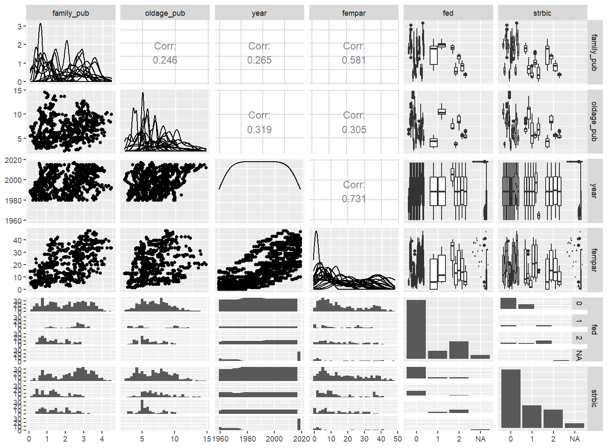

class: inverse, middle 
### Datenanalyse mit R
# # 12 (multiple) lineare Regression
### Tobias Wiß, Carmen Walenta und Felix Wohlgemuth
### 29.05.2020

```{r set up, include=FALSE}
# create #<< for highlighting
hook_source <- knitr::knit_hooks$get('source')
knitr::knit_hooks$set(source = function(x, options) {
  x <- stringr::str_replace(x, "^[[:blank:]]?([^*].+?)[[:blank:]]*#<<[[:blank:]]*$", "*\\1")
  hook_source(x, options)
})
```
---
# Daten für diese Woche

Der Comparative Welfare States 2020 Datensatz beinhaltet Variablen zu den Ausgaben für Sozialpolitik, aber auch sozioökonomische, makroökonomische, demographische und politische Variablen für 22 Länder von 1960 bis 2018. 

Den Datensatz und das Codebook finden Sie unter:  https://www.lisdatacenter.org/news-and-events/comparative-welfare-states-dataset-2020/ 

Sie finden die Daten und das Codebook natürlich auch auf moodle.
```{r preliminaries, error=FALSE, warning=FALSE, message=FALSE}
library(tidyverse)
library(readxl)
cws_data <- read_excel("_raw/CWS-data-2020.xlsx")
```
---
class: inverse, middle
## Wiederholung
# Visuelle Darstellung mehrerer Variablen
---
# kategoriale Variablen
Der Zusammenhang zweier kategorialen Variablen kann mit `geom_count()` visualisiert werden:
```{r count, fig.height=3.5, fig.width=4.5, fig.align = 'center', dpi=100}
cws_data %>% drop_na(fed, strbic) %>% 
ggplot(aes(x = as.ordered(fed), y = as.ordered(strbic))) +
  {{geom_count()}}
```
---
# kategoriale & kontinuierliche Variable
* Der Zusammenhang einer kategorialen und einer kontinuierlichen Variable wird mit einem `geom_boxplot()` visualisiert:
```{r boxplot, fig.height=3.5, fig.width=4.5, fig.align = 'center', dpi=100}
cws_data %>% drop_na(fed, family_pub) %>% 
ggplot(aes(x = as.ordered(fed),  y = family_pub)) +
  geom_boxplot() #<<
```
---
# kontinuerliche Variablen
Der Zusammenhang zweier kontinuierlichen Variablen kann mit `geom_point()` visualisiert werden und mit `geom_smooth(method = "lm")` wird eine lineare Regressionsgerade in den Plot gelegt.
```{r point, message=FALSE, fig.height=3, fig.width=4.5, fig.align = 'center', dpi=100}
cws_data %>% drop_na(fempar, family_pub) %>% 
  ggplot(aes(x = fempar, y = family_pub)) +
  geom_point() + geom_smooth(method = "lm") #<<
```
---
# viele Datenpunkte
Bei viele Datenpunkten ist es sinnvoll den Zusammenhang zwischen zwei Variablen anhand einer dritten kategorialen Variable mit `facet_wrap(~ 3.Variable)` zu unterteilen. ZB kann der Zusammenhang zwischen dem Anteil der Frauen im Parlament und den Jahre, also die Entwicklung des Anteils von Frauen im Parlament über die Zeit je Land visualisiert werden:
```{r facet_wrap 1}
plot_fempar_year <- cws_data %>% 
  ggplot(aes(x = year, y = fempar)) +
  geom_point() +
  geom_line() +
  facet_wrap(~ id) #<<
```
*Bei `facet_grid()` muss angegeben werden ob die Unterteilung nach Reihen oder Spalten geschieht. `facet_wrap()` verteilt die Plots in Reihen und Spalten (mehr Infos: https://stackoverflow.com/questions/20457905/whats-the-difference-between-facet-wrap-and-facet-grid-in-ggplot2)*
---
# Viele Datenpunkte
```{r facet_wrap 2, fig.height=5, fig.width=9.5, fig.align= 'center', dpi=150}
plot_fempar_year
```
---
# viele Datenpunkte
Eine weitere Möglichkeit ist eine Heatmap per `geom_bin2d()`:
```{r heatmap, message=FALSE, fig.height=3, fig.width=4.5, fig.align = 'center', dpi=120}
cws_data %>% drop_na(family_pub, oldage_pub) %>% 
  ggplot(aes(x = oldage_pub, y = family_pub)) +
  geom_bin2d() #<<
```
---
# explorative Plots
Um einen ersten Überblick über den Zusammenhang zwischen mehreren Variablen zu bekommen, kann `ggpairs()` verwendet werden. Es sollten maximal 6 Variablen ausgewählt werden (bei einem großen Bildschirm geht auch mehr). 

**Es ist wichtig, dass der Datentyp der Variablen richtig spezifiziert ist!**
```{r ggpair 1, eval=FALSE}
library(GGally)
expl_plot <- cws_data %>% 
  mutate(fed = as.ordered(fed)) %>% 
  mutate(strbic = as.ordered(strbic)) %>% 
  ggpairs(cws_data, columns = c("family_pub", "oldage_pub", "year", "fempar", "fed" ,"strbic")) #<<
```
---

---
class: inverse
# R Sprechstunde Inhalte
Folgende Punkte haben wir diese Woche in der R Sprechstunde (28.05.) besprochen:

`ggpairs()` wählt die passende Visualisierung auf Basis der Variablentypen der ausgewählten Variablen. Falls diese aber nicht richtig im Datensatz definiert sind, werden falsche Visualisierungstypen verwenden. Daher ist es wichtig die Variablen im Datensatz richtig mit `as.numeric()`, `as.character()`, `as.ordered()` oder `as.factor()`  zu spezifizieren. Wenn Sie den Datensatz im Environment-Fenster anklicken sehen sie den Typ der Variablen im Datensatz. 

Ich habe für Sie die Datentypen im wvs_short_w6 Datensatz richtig spezifiziert. Im Codebook sehen Sie die Ausprägungen und Typen jeder Variable.   
Falls Sie Daten aus der .csv-Datei importieren, gehen diese Typen verloren. Beim Laden der Daten ordnet R anhand der Werte die Variablen einem Typ zu. Bei Variablen mit Zahlen als Werte wird daraus eine numerische Variable, jedoch sind einige Variablen im Datensatz ordinalskaliert. Das geht im .csv-Datensatz verloren.  
Verwenden Sie den .rds-Datensatz da werden die Variablentypen richtig importiert.
---
class: inverse, middle
# (multiple) lineare Regression
---
# lineare Regression
Mit `geom_smooth(method = "lm")` haben wir letzte Woche eine Trendgerade mittig in die Punktwolke zweier Variablen gelegt. Damit haben wir zB gesehen, dass, dass die Ausgaben für Familienpolitik und der Anteil von Frauen im Parlament positiv korrelieren. 

Bei einer linearen Regression erklären wir eine abhängige Variable (y = Ausgaben für Familienpolitik) anhand einer linearen Funktion der unabhängigen Variable (x = Anteil der Frauen im Parlament). 
$$
y = \beta_0 + \beta_1 * x
$$
Uns interessiert das Einflussgewicht der Variable "Anteil von Frauen im Parlament" auf die Variable "Ausgaben für Familienpolitik": $\beta_1$

$\beta_0$ ist der Intercept der Funktion, also der y-Wert bei dem x gleich Null ist. Das lineare Modell sucht die Gerade mit den geringsten Abstand zu den y-Werten, also den kleinsten Residuen.  
---
# lineare Regression
Ein lineares Modell wir mit `lm(abhängige Variable ~ unabhängige Variable, data = dataframe)` erstellt:  
*Wir beschränken unsere Daten auf das Jahr 2015, so dass wir die Länder und nicht die Entwicklung über die Zeit vergleichen.*
```{r lm 1}
cws_data_15 <- filter(cws_data, year == 2015)
lm_fampol_fempar <- lm(family_pub ~ fempar, data = cws_data_15) #<<
```

Um die Ergebnisse des Modells anzuzeigen, kann einfach der Name des Modells eingegeben werden:
```{r lm2}
lm_fampol_fempar #<<
```
---
# lineare Regression
```{r lm3}
lm_fampol_fempar #<<
```
Interpretation der Koeffizienten:
* $\beta_0$ = 0.9117 : Basierend auf unseren Daten aus dem Jahr 2015, hätte ein Land ohne Frauen im Parlament öffentliche Ausgaben für Familienpolitik von 0.9117 % des BIPs
* $\beta_1$ = 0.0446 : Erhöht sich der Anteil von Frauen im Parlament um 1 Prozentpunkt erhöhen sich die Ausgaben für Familienpolitik um 0.0446 Prozentpunkte

Wir wissen aber noch nicht, ob der Zusammenhang statistisch signifikant ist und wie gut unser Modell im Vergleich zum Nullmodell (kein Einfluss) ist. 
---
# lineare Regression
Die ausführlichen Ergebnisse des Modells bekommen wir mit `summary()`: 
```{r lm4}
summary(lm_fampol_fempar) #<<
```
---
# lineare Regression
Oder mit `tidy()` und `glance()` aus dem broom Paket. Damit erhalten wir die Ergebnisse in einem dataframe, das auch als eigenes Objekt gespeichert werden kann:
```{r lm5}
# install.packages("broom")
library(broom)
tidy(lm_fampol_fempar, conf.int = TRUE) #<<
glance(lm_fampol_fempar) #<<
```
---
# lineare Regression
Der Regressionskoeffizient des Anteils von Frauen im Parlament $\beta_1$ = 0.0446 wird unter "estimate" angezeigt. 

Unter "p.value" oder "Pr(>|t|)" wird angezeigt, ob der Einfluss der Variable statistisch signifikant ist. Da der Wert unter 0.5 ist, ist der Einfluss des Anteils von Frauen im Parlament auf die Ausgaben für Familienpolitik statistisch signifikant. Bei `summary()` wird das zusätzlich per * angezeigt. 

Der Wert des adjusted R² = 0.151 bedeutet, dass unser Modell einen 15% kleineren Vorhersagefehler als das Nullmodell hat.  
*(Die logLik, AIC und BIC Werte werden für den Vergleich von Modellen gebraucht.)*
---
# lineare Regression - Vorhersagen
Mit `augment()` können wir jeden Wert der abhängigen Variable auf Basis des Modells vorhersagen und gemeinsam mit `ggplot()` zeigen, wie gut unser Modell zu den Daten passt.
```{r augment, fig.height=2.5, fig.width=4.5, fig.align = 'center', dpi=100}
lm_fampol_fempar_aug <- augment(lm_fampol_fempar)
ggplot(lm_fampol_fempar_aug , aes(x=fempar, y=family_pub)) +
  geom_segment(aes(xend = fempar, y = family_pub, yend = .fitted), colour = "red") +
  geom_point() + geom_line(aes(x=fempar, y=.fitted))
```
---
# lineare Regression - Annahmen
* *Linearität des Zusammenhangs*: Ob der Zusammenhang am besten mit einer linearen Gerade erklärt wird oder mit einer anderen Form der Geraden kann am besten in einem Scatterplot erkannt werden:
```{r lm annahme 1, fig.height=2.5, fig.width=4.5, fig.align = 'center', dpi=100}
ggplot(cws_data_15, aes(x = fempar, y = family_pub)) +  
  geom_point() + geom_smooth(method = "lm")
```
Die lineare Regressionsgerade scheint gut zu passen. 
---
# lineare Regression - Annahmen
* *Normalverteilung der Residuen*: Sieht man am besten in einem Histogramm der Residuen:
```{r lm annahme 2, fig.height=2.5, fig.width=4.5, fig.align = 'center', dpi=100}
ggplot(lm_fampol_fempar_aug, aes(x =.resid)) +  
  geom_histogram(binwidth = 0.5)
```
Die Residuen sind rechtsschief verteilt. Hier braucht es eventuell eine Anpassung der Daten, zB durch Standardisierung. 
---
# lineare Regression - Annahmen
* *Konstante Varianz (Homoskedastizität)*: Die Größe der Residuen muss unabhängig von der Höhe der vorhergesagten Werte sein, d.h. wie gut das Modell vorhersagt muss unabhängig von der Höhe der Variablenwerte sein.
```{r lm annahme 3, fig.height=2.5, fig.width=4.5, fig.align = 'center', dpi=100}
ggplot(lm_fampol_fempar_aug, aes(y =.resid, x =.fitted)) +
    geom_jitter(alpha = .2, width = .005)
```
Bei Heteroskedastizität würden wir einen Zusammenhang zwischen den Größen der vorhergesagten Werten und der Größe der Residuen sehen. Das ist hier nicht der Fall.
---
# lineare Regression - Annahmen
* *Keine extremen Ausreißer*: Erkennt man am besten mit einem Scatterplot
```{r lm annahme 4, fig.height=2.5, fig.width=4.5, fig.align = 'center', dpi=100}
ggplot(cws_data_15, aes(x = fempar, y = family_pub)) +  geom_point()
```
Eventuell könnte man den niedrigen Werte (fempar < 10) aus den Modell nehmen.
---
# lineare Regression - Annahmen

* *Unabhängigkeit der Beobachtungen*: Gibt es einen Zusammenhang zwischen den Beobachtungen also Ländern? EU-Mitgliedschaft könnte die Ausgaben für Familienpolitik in den Ländern beeinflussen, weil sie der maternity leave directive unterliegen. EU-Mitgliedschaft könnte als eigene Variable im Modell berücksichtigt werden. 
---
# lineare Regression mit einer kategorialen unabhängigen Variable
In einer linearen Regression können auch kategoriale Variablen als unabhängige Variablen verwendet werden. 

`fed` "Degree of federalism" hat die Ausprägungen 0,1,2.
```{r lm kat 1}
lm_fampol_fed <- lm(family_pub ~ fed, data = cws_data_15)
```
Der Regressionskoeffizient muss jetzt ein wenig anders interpretiert werden. 
Erhöht sich der Wert von `fed` um 1, also wechselt in ein höheres Level, sinken die Ausgaben für Familienpolitik um 0.2758.  
Dieser Koeffizient ist nicht statistisch signifikant und das adjusted R² ist sehr niedrig. Daher erklärt dieses Modell die Ausgaben für Familienpolitik nicht.
---
# lineare Regression mit einer kateogrialen unabhängigen Variable
```{r lm kat 2}
summary(lm_fampol_fed)
```
---
# Multiple Regression
Das lineare Regressionsmodell kann einfach durch mehrere Variablen erweitert werden. Dazu werden die Namen der Variablen in das lm-Modell per + hinzugefügt:
```{r multiple 1}
lm_fampol_multiple <- lm(family_pub ~ fempar + fed + tfr + leftcab + rtcab + unemr, 
                         data = cws_data_15)
```
---
```{r multiple 2}
summary(lm_fampol_multiple)
```
---
# Multiple Regression
Betrachtet man die Ergebnisse der linearen Regression mit mehreren unabhängigen Variablen zeigt sich, dass weiterhin der Anteil von Frauen im Parlament einen statistisch signifikanten Einfluss auf die Ausgaben für Familienpolitik hat. 

Hält man alle anderen Variablen im Modell konstant, erhöhen sich die Ausgaben für Familienpolitik um 0.044 Prozentpunkte wenn sich der Anteil von Frauen um ein 1 Prozentpunkt erhöht. 

Unser Modell hat ein größeres adjusted R² als unser erstes Modell. Der Wert ist jedoch mit Vorsicht zu genießen, da sich das R² automatisch mit dem Hinzufügen von Variablen erhöht. 

Die Auswahl der Variablen im Modell sollte aufgrund von theoretischen Gründen geschehen.
---
# Übung 12
* Verwenden Sie den CWS-data-2020 Datensatz.

* Wählen Sie eine abhängige Variable aus, also eine Variable die Sie erklären möchten.

* Wählen Sie mehrere unabhängige Variablen aus die einen Einfluss auf die abhängige Variable haben könnten.

* Erstellen Sie ein lineares Regressionsmodell mit den Variablen per `lm()`.

* Geben Sie die Ergebnisse aus und interpretieren Sie die interessanten Koeffizienten und Indikatoren.

* Laden Sie Ihr R Skript bis 05.06.2020 auf moodle.

