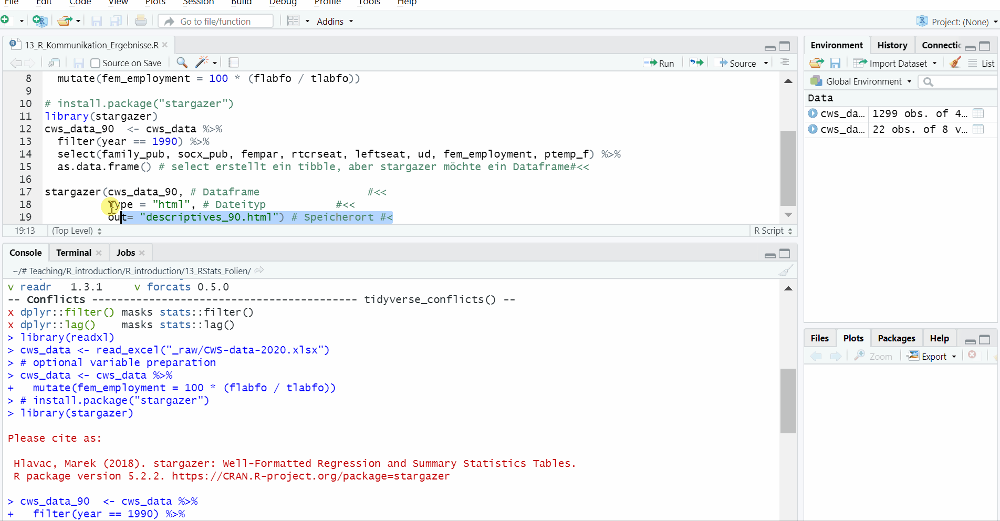
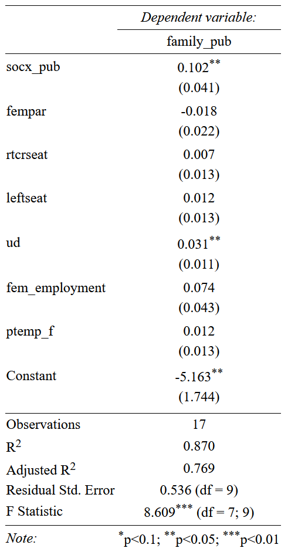
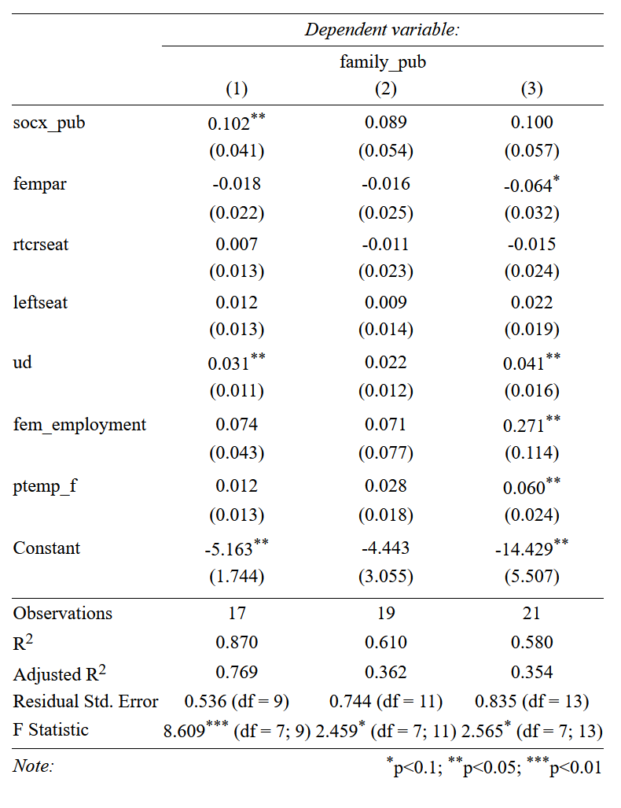
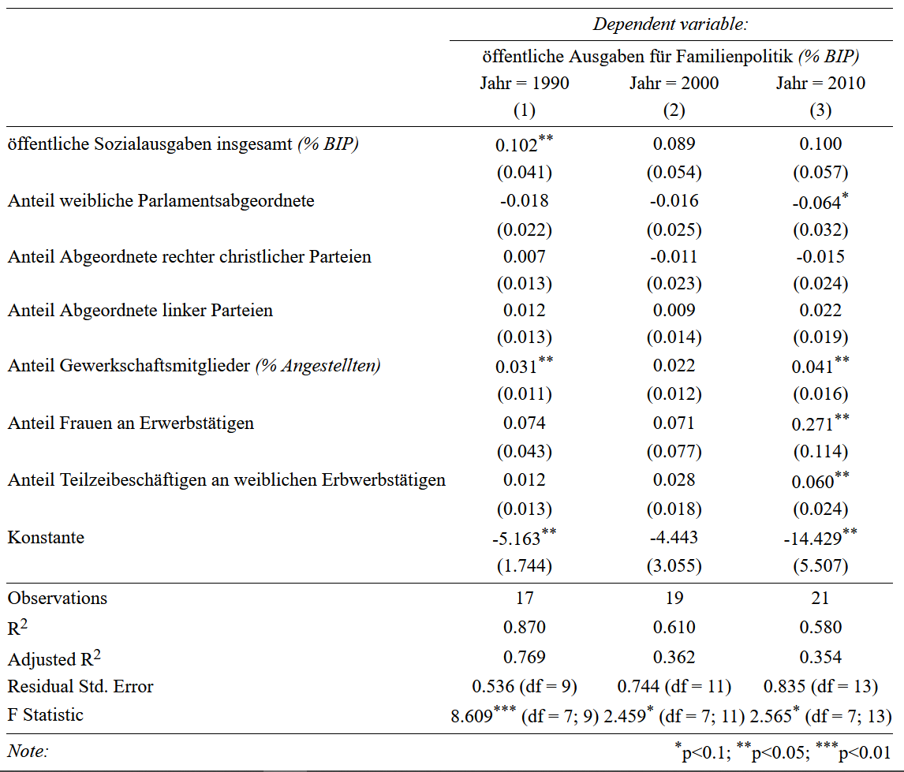

class: inverse, middle 
### Datenanalyse mit R
# # 13 Kommunikation von Ergebnissen 1
### Tobias Wiß, Carmen Walenta und Felix Wohlgemuth
### 05.06.2020

```{r set up, include=FALSE}
# create #<< for highlighting
hook_source <- knitr::knit_hooks$get('source')
knitr::knit_hooks$set(source = function(x, options) {
  x <- stringr::str_replace(x, "^[[:blank:]]?([^*].+?)[[:blank:]]*#<<[[:blank:]]*$", "*\\1")
  hook_source(x, options)
})
```
---
# Daten für diese Woche

Der Comparative Welfare States 2020 Datensatz beinhaltet Variablen zu den Ausgaben für Sozialpolitik, aber auch sozioökonomische, makroökonomische, demographische und politische Variablen für 22 Länder von 1960 bis 2018. 

Den Datensatz und das Codebook finden Sie unter:  https://www.lisdatacenter.org/news-and-events/comparative-welfare-states-dataset-2020/ 

Sie finden die Daten und das Codebook natürlich auch auf moodle.
```{r preliminaries, error=FALSE, warning=FALSE, message=FALSE}
library(tidyverse)
library(readxl)
cws_data <- read_excel("_raw/CWS-data-2020.xlsx")
```
---
class: inverse, middle
## Wiederholung
# (multiple) lineare Regression
---
# lineare Regression - Modell
Ein lineares Modell wird mit `lm(abhängige Variable ~ unabhänge Variable, data = Dataframe)` erstellt. 

*Funktionen die nicht aus dem tidyverse stammen, wie zB `lm()`, können auch mit `%>%` kombiniert werden. Mit `.` werden die Daten aus %>% als Input festgelegt.*
```{r lm 1}
lm1 <- cws_data %>% 
  filter(year == 1990) %>% 
  lm(family_pub ~ fempar, data = . ) #<<
```
---
# lineare Regression - Ergebnisse
`summary(lm1)` zeigt die Ergebnisse des linearen Regressionsmodels:
```{r lm 1am, echo = FALSE}
summary(lm1) #<<
```
---
# lineare Regression - Ergebnisse
Alternativ kann auch `tidy()` und `glance()` aus dem broom-Paket verwendet werden.  
Der Output ist ein dataframe und kann in einem eigenen Objekt gespeichert werden. Dadurch können wir den Output weiterverwenden und zB mit `kable()` aus dem kableExtra-Paket die Ergebnisse in einer html-Tabelle darstellen:
```{r lm 1b, error=FALSE, warning=FALSE, message=FALSE}
library(broom)
lm1_coeff <- tidy(lm1) #<<

library(kableExtra)
kable(lm1_coeff) %>% kable_styling(bootstrap_options  = "condensed")
```
---
# lineare Regression - Ergebnisse
*Wie `kable()` genau funktioniert und wie Ergebnisse von R nach Word übetragen werden, behandeln wir nach der Wiederholung.*
```{r lm 1c}
lm1_fit <- glance(lm1) #<<
kable(lm1_fit) %>% kable_styling(bootstrap_options  = "condensed") %>% scroll_box(width = "750px")
```
---
# lineare Regression - Vorhersagen
Mit `augment()` werden dem ursprünglichen Datensatz (Werte der abhängigen und unabhängigen Variable(n) im Modell) die vorhergesagten Werte `.fitted` und die Residuen `.resid` hinzugefügt:
```{r lm 1d}
lm1_augment <- augment(lm1) #<<
kable(lm1_augment) %>% kable_styling(bootstrap_options  = "condensed") %>% scroll_box(width = "750px", height = "280px")
```
---
# lineare Regression - Vorhersagen
Mit `augment()` können auch für selbst gewählte Werte der unabhängigen Variable(n) die Werte der abhängigen Variable vorhergesagt werden. Dafür benötigen wir ein Dataframe mit neuen Werte für fempar:
```{r lm 1e}
new_fempar <- data.frame("fempar" = c(0, 25, 50, 75, 100))
lm1_predict <- augment(lm1, newdata = new_fempar) #<<
kable(lm1_predict)
```
---
# lineare Regression - Vorhersagen
Für Vorhersagen kann auch der `predict()` Befehl verwendet werden. Dem Output fehlen jedoch die selbst gewählten Werte und der Output ist auch kein Dataframe: *(Mehr Infos: http://www.sthda.com/english/articles/40-regression-analysis/166-predict-in-r-model-predictions-and-confidence-intervals/)*
```{r lm 1f}
lm1_predict2 <- predict(lm1, newdata = new_fempar, interval = "confidence") # 95% Konfidenzintervall #<<
lm1_predict2 <- data.frame(new_fempar, lm1_predict2)
kable(lm1_predict2)
```

*Das 95%-Konfidenzintervall für die vorhergesagten Werte ist das graue Band rund im die Regressionsgeraden bei `geom_smooth(method = "lm")`* 
---
# lineare Regression - Annahmen
| Annahme                               | Überprüfungsmethode                                  |
| :------------------------------------ | :--------------------------------------------------- |
| Linearität des Zusammenhangs          | Scatterplot                                          |
| Keine extremen Ausreißer              | Scatterplot                                          |
| Normalverteilung der Residuen         | Histogramm der Residuen                              |
| Konstante Varianz (Homoskedastizität) | Scatterplot der Residuen und vorhergesagten y-Werten |
| Unabhängigkeit der Beobachtungen      | theoretische/konzeptionelle Überprüfung              | 
---
# multiple lineare Regression
Für ein Regressionsmodell mit mehreren unabhängigen Variablen werden in `lm()` mehrere Variablen getrennt durch `+` angegeben.
```{r lm multiple 1}
# optional variable preparation
cws_data <- cws_data %>% 
  mutate(fem_employment = 100 * (flabfo / tlabfo))

# multiple linear model specification
# for 3 different years
cws_data_90 <- cws_data %>% filter(year == 1990) 
lm_90 <- lm(family_pub ~ socx_pub +  fempar + rtcrseat + leftseat + ud + fem_employment + ptemp_f, data = cws_data_90 ) #<<

cws_data_00 <- cws_data %>% filter(year == 2000)
lm_00 <- lm(family_pub ~ socx_pub +  fempar + rtcrseat + leftseat + ud + fem_employment + ptemp_f, data = cws_data_00 ) #<<

cws_data_10 <- cws_data %>% filter(year == 2010)
lm_10 <- lm(family_pub ~ socx_pub +  fempar + rtcrseat + leftseat + ud + fem_employment + ptemp_f, data = cws_data_10 ) #<<
```
*Um die Ergebnisse der multiplen Regressionsmodelle anzuzeigen, wird auch `summary()` oder `tidy()` und `glance()` verwendet.*
---
# multiple lineare Regression
*Folgende Variablen werden im Beispiel verwendet:*  

|  | Name         | Inhalt                                                                                             |     
| :---- | :------------- | :------------------------------------------------------------------------------------------------- |
| AV    | family_pub     | Public expenditure on family benefits (% GDP)                                      |     
| UV1   | socx_pub       | Total public social expenditure (% GDP)                                             |     
| UV2   | fempar         | Share of seats in parliament held by women                                                         |     
| UV3   | rtcrseat       | Share of seats in parliament won by parties classified as right Christian                          |     
| UV4   | leftseat       | Share of seats in parliament won by parties classified as left                                     |     
| UV5   | ud             | Union density (net union membership as a % of employed wage and salary earners) |     
| UV6   | fem_employment | Share of female labour force (flabfo), as % of total labour force (tlabfo)                |     
| UV7   | ptemp_f        | Part-time employment for females, all ages, as a % of employment                          |     
---
```{r lm multiple 2, echo=FALSE}
summary(lm_90)
```
---
```{r lm multiple 3, echo=FALSE}
summary(lm_00)
```
---
```{r lm multiple 4, echo=FALSE}
summary(lm_10)
```
---
class: inverse, middle
#  Kommunikation von Ergebnissen 1
---
# R und Word
Die Zusammenfassung der Regressionsergebnisse mit `summary()` beinhaltet alle wichtigen Informationen über unser Modell, doch leider sieht die Tabelle nicht so aus als ob sie direkt in Word kopiert werden kann. Natürlich können alle Outputs von R aus der Konsole kopiert und dann in Word oder Excel in Form gebracht werden. Aber es gibt eine Reihe von Befehlen, die das einfacher macht.

Um einfache Tabellen und Regressionstabellen von R nach Word zu kopieren, benötigen wir ein Zwischenschritt. Mit `stargazer()` oder `kable()` erstellen wir zuerst html-Tabellen und speichern diese ab. html-Tabellen können einfach in einem Browser geöffnet, makiert und dann nach Word kopiert werden. Das Layout und Aussehen der kopierten Tabelle kann dann direkt in Word geändert und somit dem Textstil angepasst werden.

*Alternativ können wir auch direkt Latex-Tabellen erstellen oder in R mit RMarkdown den Bericht schreiben. In der nächsten Sitzung wird es eine kurze Einführung in R Markdown geben. Alle Funktionen von heute können auch in R Markdown verwendet werden.* 
---
# Kommunikation - Deskriptive Statistik
Wenn in `stargazer()` ein Dataframe ohne weitere Spezifikation angegeben wird, wird automatisch eine Tabelle mit deskriptiven Statistikmaßen erstellt:
```{r komm 1a, message=FALSE, results="hide"}
# install.package("stargazer")
library(stargazer)
cws_data_90  <- cws_data %>% 
  filter(year == 1990) %>% 
  select(family_pub, socx_pub, fempar, rtcrseat, leftseat, ud, fem_employment, ptemp_f) %>% 
  as.data.frame() # select erstellt ein tibble, aber stargazer arbeitet mit Dataframes als Input#<< 

stargazer(cws_data_90, # Dataframe                 #<<
          type = "html", # Dateityp           #<<
          out= "descriptives_90.html") # Speicherort #<<
```
---
# Kommunikation - Deskriptive Statistik
Die html-Tabelle befindet sich unter dem Dateipfad, der bei `out = ` angegeben wurde. Dann die html-Datei im Browser öffnen, markieren und in das Worddokument kopieren. 


---
# Kommunikation - Deskriptive Statistik
<table style="text-align:center"><tr><td colspan="8" style="border-bottom: 1px solid black"></td></tr><tr><td style="text-align:left">Statistic</td><td>N</td><td>Mean</td><td>St. Dev.</td><td>Min</td><td>Pctl(25)</td><td>Pctl(75)</td><td>Max</td></tr>
<tr><td colspan="8" style="border-bottom: 1px solid black"></td></tr><tr><td style="text-align:left">family_pub</td><td>22</td><td>1.734</td><td>1.041</td><td>0.312</td><td>0.733</td><td>2.493</td><td>4.033</td></tr>
<tr><td style="text-align:left">socx_pub</td><td>22</td><td>18.924</td><td>4.747</td><td>10.927</td><td>15.108</td><td>22.849</td><td>27.237</td></tr>
<tr><td style="text-align:left">fempar</td><td>22</td><td>15.545</td><td>10.626</td><td>2.340</td><td>7.098</td><td>20.322</td><td>38.400</td></tr>
<tr><td style="text-align:left">rtcrseat</td><td>22</td><td>2.168</td><td>9.626</td><td>0</td><td>0</td><td>0</td><td>45</td></tr>
<tr><td style="text-align:left">leftseat</td><td>22</td><td>38.964</td><td>15.063</td><td>0.000</td><td>34.300</td><td>48.475</td><td>56.400</td></tr>
<tr><td style="text-align:left">ud</td><td>22</td><td>40.695</td><td>19.587</td><td>9.827</td><td>26.340</td><td>50.726</td><td>81.505</td></tr>
<tr><td style="text-align:left">fem_employment</td><td>20</td><td>42.064</td><td>3.841</td><td>34.966</td><td>40.046</td><td>44.569</td><td>47.986</td></tr>
<tr><td style="text-align:left">ptemp_f</td><td>18</td><td>25.492</td><td>11.273</td><td>10.624</td><td>18.541</td><td>29.763</td><td>52.514</td></tr>
<tr><td colspan="8" style="border-bottom: 1px solid black"></td></tr></table>

*N* : Anzahl der Beobachtungen; *St. Dev.* : Standardabweichung; *Min* : Minimum; *Max* : Maximum; 
*Pctl(25)* : 25%-Perzentil; *Mean* : arimethisches Mittel (50%-Perzentil); *Pctl(75)* : 75%-Perzentil
---
# Kommunikation - Deskriptive Statistik
Die Varialennamen und die Darstellung der Maße können nun in Word geändert werden oder auch gleich in `stargazer()`. Der Vorteil ist wie immer, dass im R-Skript alles nachvollziehbar ist. Folgende Optionen können in `stargazer()` verwendet werden:
* `digits = ` : Anzahl der Nachkommastellen
* `title = ` : Tabellentitel
* `covariate.labels = c()` : angezeigte Variablennamen  
(neue Namen müssen in der gleichen Reihenfolge sein wie die Variablen im Dataframe)
* `decimal.mark = "," ` : Deutsche Darstellung von Kommastellen

*Für die Darstellung von Regressionsergebnissen können noch weitere Optionen verwendet werden.*
---
# Kommunikation - Deskriptive Statistik
```{r komm 1b,message=FALSE, results="hide"}
stargazer(cws_data_90,                
          digits = 2,             #<<
          decimal.mark = ",", #<<
          title = "Deskriptive Statistik", # Tabellentitel #<<
          covariate.labels = c("öffentliche Ausgaben für Familienpolitik <i>(% BIP)</i>", #<<
                               "öffentliche Sozialausgaben insgesamt <i>(% BIP)</i>", #<<
                               "Anteil weibliche Parlamentsabgeordnete", #<<
                               "Anteil Abgeordnete rechter christlicher Parteien", #<<
                               "Anteil Abgeordnete linker Parteien", #<<
                               "Anteil Gewerkschaftsmitglieder <i>(% Angestellten)</i>", #<<
                               "Anteil Frauen an Erwerbstätigen", #<<
                               "Anteil Teilzeibeschäftigen an weiblichen Erbwerbstätigen"), #<<
                    type = "html",          
                    out= "descriptives_90.html")
```
*Da der Output eine html-Datei ist, können html-Tags wie `<i></i>` oder auch `<strong></strong>` verwendet werden* 
---
<table style="text-align:center"><caption><strong>Deskriptive Statistik</strong></caption>
<tr><td colspan="8" style="border-bottom: 1px solid black"></td></tr><tr><td style="text-align:left">Statistic</td><td>N</td><td>Mean</td><td>St. Dev.</td><td>Min</td><td>Pctl(25)</td><td>Pctl(75)</td><td>Max</td></tr>
<tr><td colspan="8" style="border-bottom: 1px solid black"></td></tr><tr><td style="text-align:left">öffentliche Ausgaben für Familienpolitik <i>(% BIP)</i></td><td>22</td><td>1,73</td><td>1,04</td><td>0,31</td><td>0,73</td><td>2,49</td><td>4,03</td></tr>
<tr><td style="text-align:left">öffentliche Sozialausgaben insgesamt <i>(% BIP)</i></td><td>22</td><td>18,92</td><td>4,75</td><td>10,93</td><td>15,11</td><td>22,85</td><td>27,24</td></tr>
<tr><td style="text-align:left">Anteil weibliche Parlamentsabgeordnete</td><td>22</td><td>15,54</td><td>10,63</td><td>2,34</td><td>7,10</td><td>20,32</td><td>38,40</td></tr>
<tr><td style="text-align:left">Anteil Abgeordnete rechter christlicher Parteien</td><td>22</td><td>2,17</td><td>9,63</td><td>0</td><td>0</td><td>0</td><td>45</td></tr>
<tr><td style="text-align:left">Anteil Abgeordnete linker Parteien</td><td>22</td><td>38,96</td><td>15,06</td><td>0,00</td><td>34,30</td><td>48,48</td><td>56,40</td></tr>
<tr><td style="text-align:left">Anteil Gewerkschaftsmitglieder <i>(% Angestellten)</i></td><td>22</td><td>40,69</td><td>19,59</td><td>9,83</td><td>26,34</td><td>50,73</td><td>81,50</td></tr>
<tr><td style="text-align:left">Anteil Frauen an Erwerbstätigen</td><td>20</td><td>42,06</td><td>3,84</td><td>34,97</td><td>40,05</td><td>44,57</td><td>47,99</td></tr>
<tr><td style="text-align:left">Anteil Teilzeibeschäftigen an weiblichen Erbwerbstätigen</td><td>18</td><td>25,49</td><td>11,27</td><td>10,62</td><td>18,54</td><td>29,76</td><td>52,51</td></tr>
<tr><td colspan="8" style="border-bottom: 1px solid black"></td></tr></table>
---
# Tabelle mit  freien Inhalt
Mit `kable()` aus dem kableExtra-Paket kann der Inhalt eines Dataframes als html-Tabelle exportiert werden. Der Inhalt kann zB ein gesamter Dataframes sein oder zB die Korrelation von `family_pub` und `fempar` je Level der `fed` Variable:
```{r komm 2a, message=FALSE}
cws_cor  <- cws_data %>% 
  filter(year == 1990) %>% 
  select(family_pub, socx_pub, fempar, rtcrseat, leftseat, ud, fem_employment, ptemp_f, fed) %>% 
  as.data.frame() %>%  
  group_by(fed) %>% 
  summarise(COR = cor(fempar, family_pub))

kable(cws_cor) %>% 
   save_kable(file = "cor_fed.html") 
```
*Mehr Infos zu `kable()`: https://haozhu233.github.io/kableExtra/awesome_table_in_html.html*
---
# Tabelle mit  freien Inhalt
```{r komm 2b, echo=FALSE}
kable(cws_cor)
```

Das Aussehen der Tabelle kann am einfachsten in Word bearbeitet werden. 
---
# Regressionstabelle
Der eigentliche Verwendungszweck von `stargazer()` ist die Erstelltung von Regressionstabellen. Dazu wird der Objektname des Regressionsmodells als Input angegeben:
```{r komm 3, message=FALSE, results="hide"}
lm_90 <- lm(family_pub ~ socx_pub +  fempar + rtcrseat + leftseat + ud + fem_employment + ptemp_f, data = cws_data_90 )

stargazer(lm_90, 
          type = "html",
          out = "lm_90_table.html")
```
---

---
# Regressionstabelle
Der Vorteil von `stargazer()` ist, dass der Befehl auch mehrere Modelle in einer Regressionstabelle darstellen kann. Damit ist ein Vergleich von Modellen möglich:
```{r komm 4, message=FALSE, results="hide"}
lm_90 <- lm(family_pub ~ socx_pub +  fempar + rtcrseat + leftseat + ud + fem_employment + ptemp_f, data = cws_data_90 )
lm_00 <- lm(family_pub ~ socx_pub +  fempar + rtcrseat + leftseat + ud + fem_employment + ptemp_f, data = cws_data_00 )
lm_10 <- lm(family_pub ~ socx_pub +  fempar + rtcrseat + leftseat + ud + fem_employment + ptemp_f, data = cws_data_10 )

stargazer(lm_90, lm_00, lm_10,
          type = "html",
          out = "lm_table.html")
```
---

---
# Regressionstabelle
Zusätzlich zu den bekannten Optionen, kann mit folgenden Optionen das Aussehen von Regressionstabellen verändert werden:
* `column.labes = c()` : Modellnamen definieren
* `dep.var.labels = c()` : Abhängige Variablennamen definieren
* `no.space = TRUE` : Leerzeilen weglassen (hilft beim Kopieren in Word)
```{r komm 5, message=FALSE, results="hide"}
stargazer(lm_90, lm_00, lm_10,
          column.labels = c("Jahr = 1990", "Jahr = 2000", "Jahr = 2010"), #<<
          dep.var.labels = c("öffentliche Ausgaben für Familienpolitik <i>(% BIP)</i>"), #<<
          covariate.labels = c("öffentliche Sozialausgaben insgesamt <i>(% BIP)</i>", #<<
                               "Anteil weibliche Parlamentsabgeordnete", #<<
                               "Anteil Abgeordnete rechter christlicher Parteien", #<<
                               "Anteil Abgeordnete linker Parteien", #<<
                               "Anteil Gewerkschaftsmitglieder <i>(% Angestellten)</i>", #<<
                               "Anteil Frauen an Erwerbstätigen", #<<
                               "Anteil Teilzeibeschäftigen an weiblichen Erbwerbstätigen", #<<
                               "Konstante"), #<<
          no.space = TRUE, #<<
          type = "html",
          out = "lm_table_2.html")
```
---

---
# Übung 13
* Verwenden Sie Daten Ihrer Wahl (alternativ CWS Daten).

* Wählen Sie eine abhängige Variable und mehrere unabhängige Variablen für ein Regressionsmodell aus.

* Erstellen Sie eine Tabelle mit deskriptiven Statistikmaßen und kopieren Sie diese in ein Worddokument.

* Erstellen Sie ein Regressionsmodell mit `lm()`.

* Erstellen Sie für das Modell eine Regressionstabelle und kopieren Sie diese in das Worddokument.

* Laden Sie Ihr R-Skript und das Worddokument (gerne als pdf) bis zum 19.06.2020 12:00 auf moodle hoch.
---
## nächste Woche:
# Kommunikation von Ergebnissen 2
In der letzten Einheit beschäftigen wir uns weiter mit der Kommunikation von Ergebnissen.

Falls Sie Fragen zur Darstellung Ihrer Ergebnisse in Word haben, dann können Sie mir gerne Fragen für die letzte Stunde schicken (bis spätestens 16.06.). Bitte schauen Sie sich vorher die Folien von dieser Woche an.

Ich werde Ihnen eine kurze Einführung in R Markdown geben.
