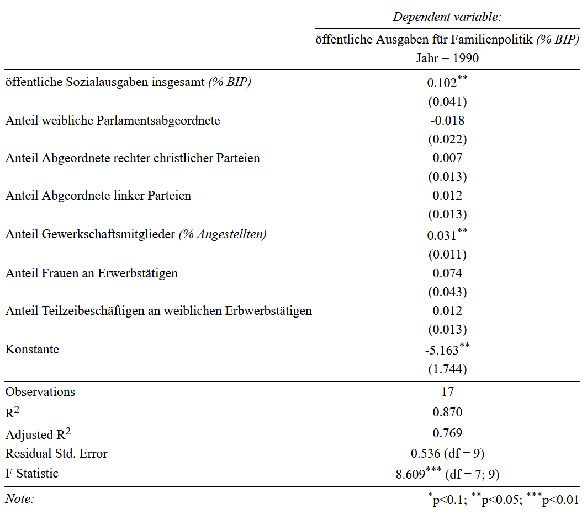
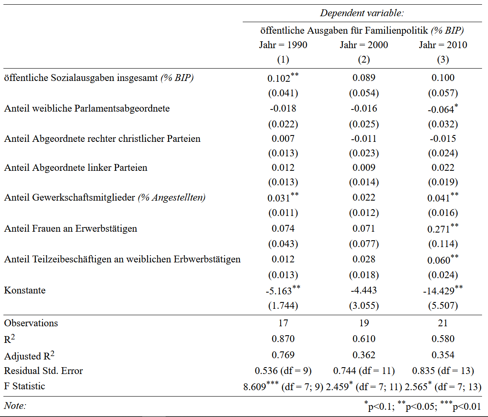
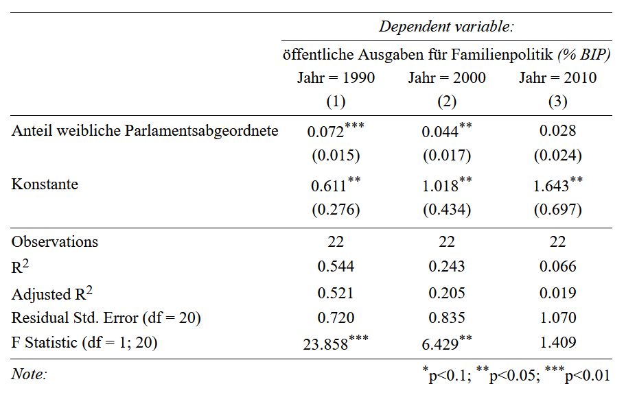
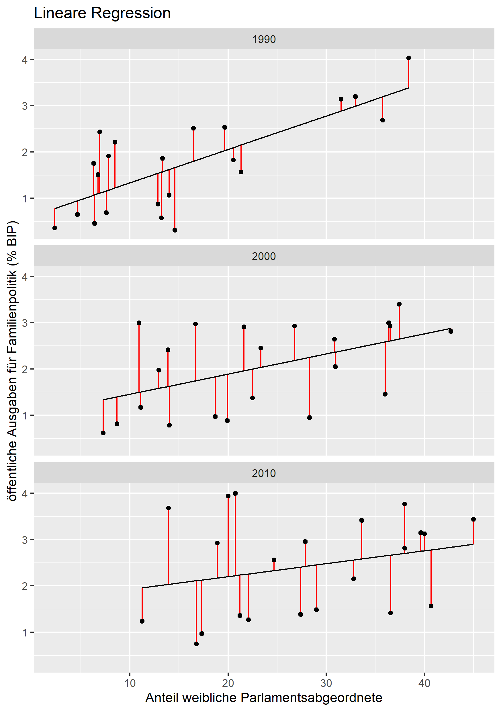

class: inverse, middle 
### Datenanalyse mit R
# # 14 Kommunikation von Ergebnissen 2
### Tobias Wiß, Carmen Walenta und Felix Wohlgemuth
### 19.06.2020

```{r set up, include=FALSE}
# create #<< for highlighting
hook_source <- knitr::knit_hooks$get('source')
knitr::knit_hooks$set(source = function(x, options) {
  x <- stringr::str_replace(x, "^[[:blank:]]?([^*].+?)[[:blank:]]*#<<[[:blank:]]*$", "*\\1")
  hook_source(x, options)
})
```
---
class: inverse, middle
Vielen Dank für Ihre rege Teilnahme am R Kurs dieses Semester! Es hat mich gefreut, dass Sie das moodle-Forum und auch die R Sprechstunde genutzt haben. Danke für die spannenden Diskussionen und hoffentlich konnte ich Ihnen bei Ihren Fragen weiterhelfen.

In der heutigen Einheit wiederholen wir nochmal wie Ergebnisse aus R in Word berichtet werden und zusätzlich werden wir noch kurz in R Markdown einsteigen. Diese Woche gibt es keine Übungsaufgabe und auch keine R Sprechstunde.
---
# Daten für diese Woche

Der Comparative Welfare States 2020 Datensatz beinhaltet Variablen zu den Ausgaben für Sozialpolitik, aber auch sozioökonomische, makroökonomische, demographische und politische Variablen für 22 Länder von 1960 bis 2018. 

Den Datensatz und das Codebook finden Sie unter:  https://www.lisdatacenter.org/news-and-events/comparative-welfare-states-dataset-2020/ 

Sie finden die Daten und das Codebook natürlich auch auf moodle.
```{r preliminaries, error=FALSE, warning=FALSE, message=FALSE}
library(tidyverse)
library(readxl)
cws_data <- read_excel("_raw/CWS-data-2020.xlsx")

# optional variable preparation
cws_data <- cws_data %>% 
  mutate(fem_employment = 100 * (flabfo / tlabfo))
```
---
class: inverse, middle
## Wiederholung
# Kommunikation von Ergebnissen mit stargazer()
---
# R und Word
Um die Ergebnisse von R mit einer Tabelle in Word zu präsentieren, kann mit `stargazer()` eine html-Tabelle erstellt werden. In einem Browser kann dann die ganze Tabelle markiert, kopiert und dann in Word eingefügt werden. `stargazer()` speichert die exportierte html-Tabelle in der vorher festgelegten Working Directory.

Das Layout und Aussehen der Tabelle kann einfach in Word bearbeitet werden. Der Vorteil hierbei ist, dass Änderungen an der Tabelle direkt gesehen werden und dass die Tabelle an den Stil des Textes angepasst werden kann. Der Nachteil ist, dass bei kleinen Änderungen an den Daten der ganze Anpassungsprozess in Word wiederholt werden muss. 

Das Aussehen und Layout der html-Tabelle kann auch gleich in `stargazer()` festgelegt werden. Der Anpassungsprozess ist somit einfacher wiederhol- und nachvollziehbar. Der letzte Feinschliff muss dann in Word gemacht werden.
---
# Tabelle Deskriptive Statistik
Wenn in `stargazer()` ein Dataframe ohne weitere Spezifikationen als Input angegeben wird, erstellt `stargazer()` eine Tabelle mit deskriptiven Statistikmaßen für alle Variablen im Dataframe. Deshalb muss der Dataframe nur die Variablen enthalten, die man auch im Bericht darstellen möchte. 

*`stargazer()` erwartet ein Dataframe als Input, deshalb kann vorher mit `str()` geprüft werden, ob das Inputobjekt ein Dataframe ist und gegebenenfalls umgewandelt werden. Da wir mit Funktionen aus dem tidyverse gearbeitet haben, ist das Datenobjekt ein tibble und kein klassischer Dataframe.* 

```{r komm 1a, message=FALSE}
library(stargazer)
cws_data_90  <- cws_data %>% 
  filter(year == 1990) %>% 
  select(family_pub, socx_pub, fempar, rtcrseat, leftseat, ud, fem_employment, ptemp_f)
str(cws_data_90)  #<<
```
---
# Tabelle Deskriptive Statistik
```{r komm 1b, message=FALSE, results="hide"}
cws_data_90 <- as.data.frame(cws_data_90)

stargazer(cws_data_90,                
    digits = 2,           
    decimal.mark = ",",
    title = "Deskriptive Statistik", 
    covariate.labels = c(
      "öffentliche Ausgaben für Familienpolitik <i>(% BIP)</i>", 
      "öffentliche Sozialausgaben insgesamt <i>(% BIP)</i>", 
      "Anteil weibliche Parlamentsabgeordnete", 
      "Anteil Abgeordnete rechter christlicher Parteien", 
      "Anteil Abgeordnete linker Parteien", 
      "Anteil Gewerkschaftsmitglieder <i>(% Angestellten)</i>",
      "Anteil Frauen an Erwerbstätigen", 
      "Anteil Teilzeibeschäftigen an weiblichen Erbwerbstätigen"), 
    type = "html",          
    out= "descriptives_90.html")
```
*In der Konsole wird der Code der html-Tabelle ausgegeben. In einem html-Dokument, wie diesen Folien, kann die Tabelle mit dem Code direkt angezeigt werden. Für Word müssen Sie die exportierte html-Datei mit einem Browser öffnen und in Word kopieren.*
---
<table style="text-align:center"><caption><strong>Deskriptive Statistik</strong></caption>
<tr><td colspan="8" style="border-bottom: 1px solid black"></td></tr><tr><td style="text-align:left">Statistic</td><td>N</td><td>Mean</td><td>St. Dev.</td><td>Min</td><td>Pctl(25)</td><td>Pctl(75)</td><td>Max</td></tr>
<tr><td colspan="8" style="border-bottom: 1px solid black"></td></tr><tr><td style="text-align:left">öffentliche Ausgaben für Familienpolitik <i>(% BIP)</i></td><td>22</td><td>1,73</td><td>1,04</td><td>0,31</td><td>0,73</td><td>2,49</td><td>4,03</td></tr>
<tr><td style="text-align:left">öffentliche Sozialausgaben insgesamt <i>(% BIP)</i></td><td>22</td><td>18,92</td><td>4,75</td><td>10,93</td><td>15,11</td><td>22,85</td><td>27,24</td></tr>
<tr><td style="text-align:left">Anteil weibliche Parlamentsabgeordnete</td><td>22</td><td>15,54</td><td>10,63</td><td>2,34</td><td>7,10</td><td>20,32</td><td>38,40</td></tr>
<tr><td style="text-align:left">Anteil Abgeordnete rechter christlicher Parteien</td><td>22</td><td>2,17</td><td>9,63</td><td>0</td><td>0</td><td>0</td><td>45</td></tr>
<tr><td style="text-align:left">Anteil Abgeordnete linker Parteien</td><td>22</td><td>38,96</td><td>15,06</td><td>0,00</td><td>34,30</td><td>48,48</td><td>56,40</td></tr>
<tr><td style="text-align:left">Anteil Gewerkschaftsmitglieder <i>(% Angestellten)</i></td><td>22</td><td>40,69</td><td>19,59</td><td>9,83</td><td>26,34</td><td>50,73</td><td>81,50</td></tr>
<tr><td style="text-align:left">Anteil Frauen an Erwerbstätigen</td><td>20</td><td>42,06</td><td>3,84</td><td>34,97</td><td>40,05</td><td>44,57</td><td>47,99</td></tr>
<tr><td style="text-align:left">Anteil Teilzeibeschäftigen an weiblichen Erbwerbstätigen</td><td>18</td><td>25,49</td><td>11,27</td><td>10,62</td><td>18,54</td><td>29,76</td><td>52,51</td></tr>
<tr><td colspan="8" style="border-bottom: 1px solid black"></td></tr></table>
---
# Regressionstabelle
Wenn ein Regressionsmodell als Input in `stargazer()` angegeben wird, erstellt `stargazer()` eine Regressionstabelle. Wie bei der Tabelle mit deskriptiven Statistikmaßen, kann der Inhalt und das Aussehen der Tabelle direkt in `stargazer()` verändert werden. Falls das nicht gemacht wird, verwendet `stargazer()` einfach die Variablennamen. Die Regressionskoeffizienten und die Parameter der Modellgüte werden dabei nicht verändert.

```{r komm 3, message=FALSE, results="hide"}
lm_90 <- lm(family_pub ~ socx_pub +  fempar + rtcrseat + leftseat + ud + fem_employment + ptemp_f, data = cws_data_90 )

stargazer(lm_90,
    column.labels = c("Jahr = 1990"), 
    dep.var.labels = c("öffentliche Ausgaben für Familienpolitik <i>(% BIP)</i>"),
    covariate.labels = c("öffentliche Sozialausgaben insgesamt <i>(% BIP)</i>",
      "Anteil weibliche Parlamentsabgeordnete", 
      "Anteil Abgeordnete rechter christlicher Parteien",
      "Anteil Abgeordnete linker Parteien",
      "Anteil Gewerkschaftsmitglieder <i>(% Angestellten)</i>", 
      "Anteil Frauen an Erwerbstätigen",
      "Anteil Teilzeibeschäftigen an weiblichen Erbwerbstätigen",
      "Konstante"),
    no.space = TRUE, type = "html", out = "lm_90_table.html")
```
---
class: center, middle 

---
# Regressionstabelle
`stargazer()` kann auch die Ergebnisse mehrerer Regressionsmodelle in einer Tabelle gemeinsam anzeigen. Damit können Modelle verglichen werden. Dazu werden einfach als Input mehrere Regressionmodelle angegeben. Die Reihenfolge im Input legt die Reihenfolge in der Tabelle fest.
``` {r komm 4, message=FALSE, results="hide"}
lm_00 <- cws_data %>% filter(year == 2000) %>% lm(family_pub ~ socx_pub +  fempar + rtcrseat + leftseat + ud + fem_employment + ptemp_f, data = . )
lm_10 <- cws_data %>% filter(year == 2010) %>% lm(family_pub ~ socx_pub +  fempar + rtcrseat + leftseat + ud + fem_employment + ptemp_f, data = . )

stargazer(lm_90, lm_00, lm_10,
    column.labels = c("Jahr = 1990", "Jahr = 2000", "Jahr = 2010"), 
    dep.var.labels = c("öffentliche Ausgaben für Familienpolitik <i>(% BIP)</i>"), 
    covariate.labels = c("öffentliche Sozialausgaben insgesamt <i>(% BIP)</i>", 
      "Anteil weibliche Parlamentsabgeordnete", 
      "Anteil Abgeordnete rechter christlicher Parteien", 
      "Anteil Abgeordnete linker Parteien", 
      "Anteil Gewerkschaftsmitglieder <i>(% Angestellten)</i>", 
      "Anteil Frauen an Erwerbstätigen", 
      "Anteil Teilzeibeschäftigen an weiblichen Erbwerbstätigen", 
      "Konstante"), 
    no.space = TRUE, type = "html", out = "lm_table_2.html")
```
---
class: center, middle 

---
class: inverse, middle
#  Kommunikation von Ergebnissen 2
---
# ggplot2 und Word
Visualisierungen, die mit `ggplot()` erstellt werden, werden im "Plots" Fenster unten rechts angezeigt. Dort kann der Plot mit *Export > Save as Image* extern abgespeichert und dann einfach als Grafik in Word eingefügt werden. Die Größe kann in Word verändert werden, aber das Seitenverhältnis und die Auflösung sollte schon beim Export richtig definiert werden. 

Zum Beispiel kann das Ergebnis dreier linearen Regressionsmodelle in einem Plot dargestellt werden. Zuerst erstellen wir die Regressionstabelle und dann auf Basis der drei Modelle die Visualisierung der Datenpunkten, Residuen und prognostizierten Werte. 
```{r kom5, message=FALSE, results="hide"}
lm_90_fempar <- cws_data %>% filter(year == 1990) %>% lm(family_pub ~ fempar, data = .)
lm_00_fempar <- cws_data %>% filter(year == 2000) %>% lm(family_pub ~ fempar, data = .)
lm_10_fempar <- cws_data %>% filter(year == 2010) %>% lm(family_pub ~ fempar, data = .)

stargazer(lm_90_fempar, lm_00_fempar, lm_10_fempar,
    column.labels = c("Jahr = 1990", "Jahr = 2000", "Jahr = 2010"), 
    dep.var.labels = c("öffentliche Ausgaben für Familienpolitik <i>(% BIP)</i>"), 
    covariate.labels = c("Anteil weibliche Parlamentsabgeordnete", "Konstante"),
    type = "html", out = "lm_fempar.html")
```
---
class: center, middle 

---
# ggplot2 und Word
Für die Visualisierung müssen wir zuerst mit `augment()` die Residuen und prognostizierten Werte berechnen. Dann bilden wir ein gemeinsames Dataframe mit `bind_rows()`, das der Input für `ggplot()` ist. Mit `facet_wrap()` werden drei einzelne Plots in einer Visualisierung erstellt.
```{r komm5, message=FALSE, results="hide", fig.show='hide'}
library(broom)
lm_90_aug <- augment(lm_90_fempar) %>% mutate(year = 1990)
lm_00_aug <- augment(lm_00_fempar) %>% mutate(year = 2000)
lm_10_aug <- augment(lm_10_fempar) %>% mutate(year = 2010)
lm_aug <- bind_rows(lm_90_aug, lm_00_aug, lm_10_aug)

ggplot(lm_aug , aes(x=fempar, y=family_pub)) +
  geom_segment(aes(xend = fempar, y = family_pub, yend = .fitted), colour = "red") +
  geom_point() + 
  geom_line(aes(x=fempar, y=.fitted)) +
  facet_wrap( ~ year, nrow = 3, ncol =1) +
  labs(title = "Lineare Regression",
             x = "Anteil weibliche Parlamentsabgeordnete",
             y = "öffentliche Ausgaben für Familienpolitik (% BIP)")
```
---
# ggplot2 und Word
Die Visualisierung erscheint unten rechts im "Plots" Fenster. Die Grafik kann nun extern gespeichert werden mit Klick auf *Export > Save as Image*. Hier kann auch die Größe in Pixel festgelegt werden. Welche Größe für das Word-Dokument passend ist, muss ausprobiert werden. Die aktuelle Grafik speichern wir als DIN A5 mit 72 ppi ab (420 x 595) (Tabelle mit Größen in Pixeln: https://www.din-formate.de/reihe-a-din-groessen-mm-pixel-dpi.html).

Alternativ kann im R Skript `ggsave()` genutzt werden. Der Vorteil ist, dass in `ggsave()` mit `units = c("in", "cm", "mm")` die Einheit und mit `dpi = ` die Auflösung festgelegt werden kann. *Wenn in `ggsave()` kein Inputobjekt angegeben wird, dann wird der letzte Plot abgespeichert*.
``` {r komm6, message=FALSE, results="hide", fig.show='hide'}
ggsave("figures/plot_lm_fempar.png",
       width = 148  , height = 210,
       units = "mm", dpi = 300)
```
Die Grafikdatei kann dann einfach mit Drag and Drop in Word hineingezogen oder mit *Einfügen > Bilder > Dieses Gerät* in das Word-Dokument eingefügt werden. Falls die Größe nicht richtig passt, muss die Höhe und Breite in `ggsave()` geändert und die Funktion wiederholt werden.
---
class: center, middle 

---
class: inverse, middle 
# R Markdown
## kurze Einführung
---
# R Markdown
Um die Ergebnisse eines Projektes in Word zu berichten, müssen wir leider eine paar Zwischenschritte machen (Tabellen in html abspeichern; Plots extern speichern und in Word einfügen). RStudio bietet mit R Markdown eine gute Alternative die Ergebnisse und den Bericht in einem Dokument zu erstellen. 

R Markdown empfiehlt sich für kurze Projektberichte, insbesondere wenn der R Code angezeigt werden soll. Für Dokumente mit mehr Text als Tabellen / Grafiken ist Word oder Latex einfacher. Alle Folien des R Kurses sowie die Lösungen für die Übungen wurden mit R Markdown erstellt. 
---
# R Markdown
## erste Schritte

Für ein neues R Markdown Dokument klicken Sie in RStudio auf *File > New File > R Markdown*. Im Fenster kann dann der Titel und der Autor_innennamen festgelegt werden. Als Output kann html, pdf oder Word gewählt werden:

* html funktioniert ohne vorherige Anpassungen und ist auch der Standard.
* Für ein pdf-Dokument muss entweder Latex installiert sein oder das Paket *TinyTex* in R. *TinyTex*  muss nur einmal installiert und nicht extra geladen werden. Mehr Infos: https://yihui.org/tinytex/
```{r Rmd, eval=FALSE}
install.packages('tinytex')
tinytex::install_tinytex()

# to uninstall TinyTeX, run tinytex::uninstall_tinytex() 
```
---
# R Markdown
Es öffnet sich dann ein Beispieldokument, das schon mal grob zeigt wie ein Markdown Skript funktioniert.

Am Anfang des Dokumentes befinden sich die Metadaten des Dokuments (YAML); 
```
---
title: "Bericht"
author: "Felix Wohlgemuth"
date: "19 6 2020"
output: pdf_document
---
```
In diesem Fall wir ein pdf Dokument erstellt. Der `output` kann aber auch ein html-Dokument sein. Meine Lösungen der Übungen waren zB einfache html-Dokumente. 
---
# Markdown Sprache
Markdown ist eine vereinfachte Auszeichnungssprache mit eigenen Regeln. Das Aussehen des Texts wird in Word mit Einstellungen im Menü bearbeitet. In Markdown wird das Aussehen direkt im Text festgelegt.

Überschriften werden mit ` # ` festgelegt
```
# Ebene 1
## Ebene 2
### Ebene 3
...
...
```
# Ebene 1
## Ebene 2
### Ebene 3
---
# Markdown Sprache
## Text
**fett** wird mit `**TEXT**` festgelegt

*kursiv* wird mit `*TEXT*`festgelegt

~~durchgestrichen~~ wird mit `~~TEXT~~` festgelegt
```
***fett**
**kursiv*
*~~durchgestrichen~~
```

---
# Markdown Sprache
### Listen
* Listen werden mit `*`, `+` oder `-` vor der Zeile festgelegt  
* nummerierte Liste werden mit `1.`, `2.`... festgelegt (die Zahl ist eigentlich egal, weil Markdown selbst nummeriert)

```
1. erstes Item
2. zweites Item
4. drittes Item
  * wenn eine ein Listenabsatz eingerückt wird, wird daraus eine Subliste
  + es ist egal ob *, +, - genutz wird
- ungeordnetes Item
```

1. erstes Item
2. zweites Item
4. drittes Item
  * wenn eine ein Listenabsatz eingerückt wird, wird daraus ein Sublisten Item
  + es ist egal ob +, +, - genutz wird
- ungeordnetes Item
---
# Markdown Sprache
### Tabellen
Für Tabellen gibt es ein einfaches Format:
```
| Tables        | Are           | Cool  |
| ------------- |:-------------:| -----:|
| col 3 is      | right-aligned | $1600 |
| col 2 is      | centered      |   $12 |
|zebra stripes| are neat  |    $1                  |
```
Die Leerzeichen sind egal, hauptsache die `|` sind an der richtigen Stelle und in der zweiten Zeile wurde mindestens ein `-` zwischen den `|` verwendet.

| Tables        | Are           | Cool  |
| ------------- |:-------------:| -----:|
| col 3 is      | right-aligned | $1600 |
| col 2 is      | centered      |   $12 |
| zebra stripes | are neat      |    $1 |
---
# Markdown Sprache
### Codes / Skripte
Das wichtigste für R Markdown sind die Code Chunks (im Beispiel Dokument sind schon drei Code Chunks mit unterschiedlichen Spezifikationen inkludiert). Code Chunks in R starten mit ` ```{r} ` und enden mit ` ``` `
````markdown
`r ''````{r}
library(tidyverse)
library(readxl)
cws_data <- read_excel("_raw/CWS-data-2020.xlsx")
```
````

Alles was innerhalb ` ```{r} ` CODE ` ``` ` geschrieben wird, führt R aus und zeigt den Code sowie den Output. Wenn innerhalb der Klammer `{r, echo = FALSE}` definiert wird, dann wird nur der Output ohne den Code angezeigt.
---
# R Markdown Setup
Am Anfang der R Markdown Datei befindet sich das YAML zwischen zwei `---`. 

Im Beispieldokument befindet sich an zweiter Stelle ein R Code Chunk, der das Verhalten aller folgenden Chunks definiert:

````markdown
`r ''````{r setup, include=FALSE}
knitr::opts_chunk$set(
    echo = FALSE,
    warning = FALSE,
    message = FALSE)
```
````
Die Optionen legen fest, dass
* der R Code im Dokument nicht angezeigt wird (`echo = FALSE`).
* keine Warn- und andere Meldungen angezeigt werden (`warning = FALSE, message = FALSE`).
---
# R Markdown
Auf moodle befindet sich ein fertiges R Markdown Skript mit Berechnungen und Grafiken der letzten Sitzung. Das Format von R Markdown Dokumenten ist `.Rmd` und kann in R Studio mit `Open File...` geöffnet werden.


### Output / Dokument erstellen
Um den Output (pdf, html oder doc) zu erstellen, muss auf der Menüleiste über dem Skriptfenster auf **"Knit"** geklickt werden. Sie werden dann gefragt, in welchem Ordnern und unter welchem Namen die Datei gespeichert werden soll. hmtl-Dokumente werden ohne Problem erstellt. Für Pdfs wird entweder Latex benötigt oder das Paket TinyTex. 
---
# R Markdown
## Cheatsheets

Cheatsheet für die Sprache Markdown: https://github.com/adam-p/markdown-here/wiki/Markdown-Cheatsheet

Cheatsheet für R Markdown mit Code Chunks Optionen: https://rstudio.com/wp-content/uploads/2016/03/rmarkdown-cheatsheet-2.0.pdf 

Infos zu den YAML Optionen: https://bookdown.org/yihui/bookdown/yaml-options.html

Sehr gute Präsentation zu R Markdown mit Übungsaufgaben: https://apreshill.github.io/rmd4cdc/

R Markdown Homepage: https://rmarkdown.rstudio.com/ 
