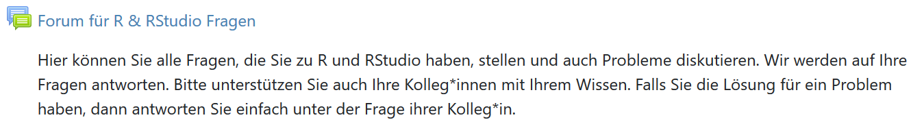

class: inverse, middle 
### Datenanalyse mit R
# Erste Schritte mit RStudio
### Tobias Wiß, Carmene Walenta und Felix Wohlgemuth
### 11.03.2020

---
# Was haben wir letzte Woche gelernt?
**R** ist die Skriptsprache, die wir zur Datenanaylse verwenden werden  

**RStudio** ist die Oberfläche, durch die wir R verwenden
* Befehle, wie zB eine kleine Rechnung, können in RStudio direkt in der **Console** eingegeben werden
* Aber, um das Vorgehen nachvollziehbar zu machen, arbeiten wir in einem **Skript** im **Editor**
* Um ein neues Skript in RStudio zu öffnen: `File -> New File -> R Skript`  
* Nachdem Sie ein Skript erstellt haben, öffnet siche der Editor

---
class: center, middle

---
# Wie sieht ein R Skript aus?
```{r skript, echo=TRUE}
# mit # werden im R Skript Kommentare gemacht
# Sie können zB am Anfang des R Skripts notieren, 
# wann Sie das Skript erstellt haben und was der Zweck ist

# title: Skript zur VU Politikfelder SS20 - Einführung in R
# subtitle: #1 Was ist R & RStudio?
# author: Felix Wohlgemuth
# date: 05.03.2020

# Sie können aber erklären was Sie als nächstes machen

# Summe wöchentliche Ausgaben für Mittagessen in der Mensa
5 * 5.80 # Dezimalstellen werden in R mit . gemacht
```
Mit `Run` oder mit der Tastenkombination `Strg + Enter` oder `Command + Enter` schicken Sie den markierten Teil des R Skripts zur Konsole  

Das Ergebnis Ihrer Rechnung wird in der Konsole nach [1] angezeigt
---
class: center, middle
Falls Sie noch Fragen haben, nutzen Sie das Forum auf moodle



---
# Variablen zuweisen
Das Ergebnis einer Berechnung können Sie mit dem Zuweisungspfeil `<-` in einer Variable oder Objekt speichern
```{r variable, echo=TRUE}
# um meine Aussgaben in der Mensa zu berechnen,
# erstelle ich das Objekt menue_1 mit dem Preis 
# des Menü Classic 1 in der Mensa

menue_1 <- 5.80
```
Nachdem Sie Ihr Skript mit der Erstellung der Variable an die Konsole geschickt haben, sehen Sie im oberen rechten Feld "Environment" die Variable mit dem Inhalt. 
---
# Variablen zuweisen
Sie könenn auch das Ergebnis einer Berechnung direkt in einer Variable speichern und existierende Variablen in Berechnungen verwenden. menue_1 ist ein Platzhalter für 5.80 und R verwendet diesen Wert in der Rechnung.
```{r variable 2, echo=TRUE}
# um meine wöchentliche Mensaausgaben zu berechnen 
# multipliziere ich dein Preis des Menü 1 mit 5 Tagen

5 * menue_1

# Das Ergebnis wird in der Konsole angezeigt
```
---
# Variablen zuweisen
```{r variable 3, echo=TRUE}
# Oder ich speichere das Ergebnis in einer neuen Variable

ausgaben_woche <- 5 * menue_1

# und nutze die Variable für die Berechnung 
# meiner monatlichen Ausgaben

ausgaben_monat <- 4.3 * ausgaben_woche

# um das Ergebnis anzuzeigen gebe ich den Variablennamen ein

ausgaben_monat
```
---
# Funktionen in R
Funktionen in R funktionieren nach der Logik 'mean()'
* zuerst steht der Namen der Funktion 'mean'
* dann in der Klammern geben sie den Namen der Variable ein oder eine Reihe von Zahlen
```{r functions, echo=TRUE}
# das arithmetische Mittel meiner monatlichen Ausgaben
mean(ausgaben_monat)
# ist natürlich der Wert der Variable, 
# weil sie nur aus einem Wert besteht
```
---
# Funktionen in R
```{r functions 2, echo=TRUE}
# wenn ich aber in einer Woche jeden Tag ein anderes Menü esse,
# schaffe ich einen Vektor, mit den Ausgaben für jeden Tag

essen_woche1 <- c(5.8, 7.20, 6.20, 4.00, 3.00)

# die Variable beinhaltet jetzt 5 Werte 
# um die Werte zu binden braucht es immer die Funktion c()

# jetzt berechne ich meine durschnittlichen Ausgaben in der Mensa
mean(essen_woche1)

# oder auch die Summe
sum(essen_woche1)
```
---
# Funktionen in R
Sie können in R auch direkt nachschlagen wie eine Funktion funktioniert, das geht mit `help()` oder `?`
```{r functions help, eval=FALSE, include=TRUE}
help("mean")
help(sum)

# oder

?mean
?sum
```
In RStudio öffnet sich dann ein Hilfefenster unten rechts in der Oberfläche. Dort finden Sie eine Erklärung wie die Funktion funktioniert und welche Grundeinstellungen sie hat.
---
class: center, middle

---
# Pakete in R 
R wird ständig von den Nutzer_innen erweitert. Diese Erweiterungen sind über **CRAN** (The Comprehensive R Archive Network) kostenfrei erhältlich.

Mit dem Paket `swirl` kann man zB interaktive Tutorials in R erstellen und durchführen.

Mit dem Befehl `install.packages(" ")`können Sie Pakete aus dem CRAN installieren. Das müssen Sie nur einmal machen. Installieren Sie Pakete direkt in der Konsole und nicht im R Skript.
```{r install_swirl, eval=FALSE}
# Um swirl zu installieren
install.packages("swirl")
```
Um das Paket in R verwenden zu können, müssen Sie es laden. Das müssen Sie in jedem R Skript machen, wenn Sie Teile des Paketes im Skript verwenden
```{r load_swirl, eval = FALSE}
# Um swirl zu laden
library(swirl)
```
---
class: center middle 

---
class: center, middle
Falls Sie noch Fragen haben, nutzen Sie das Forum auf moodle und schauen Sie in die Lektüre für diese Woche


---
# Übung
Die Übung für diese Woche funktioniert über das Paket **swirl**. 
* Zuerst starten Sie eine neue Session in RStudion `Session -> New Session` und `Session -> Clear workspace`
* Installieren Sie das Paket mit `install.packages("swirl")` (nur einmal notwendig)
* Laden Sie swirl  mit `library(swirl)`
* Installieren Sie in swirl den Kurs für diese Woche mit `install_course_github("swirldev", "R_Programming_E")`  
* Starten Sie swirl mit `swirl()`
* Nachdem Sie swirl() gestartet haben, müssen Sie ihren Namen eingeben 
* Als nächstes starten Sie den Kurs `R Programming E` (Achten Sie darauf, dass der Kursname ein E enthält)
* Wählen Sie als nächstes die Einheit `1: Basic Building Blocks` aus
* Folgen Sie den Aufgaben 
* Am Schluss können Sie mir eine E-Mail schicken, bitte verwenden Sie die Adresse **felix.wohlgemuth@jku.at**
---
