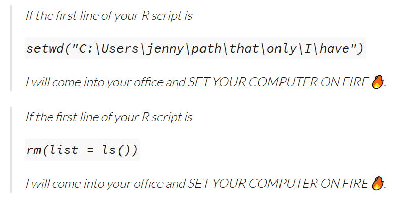
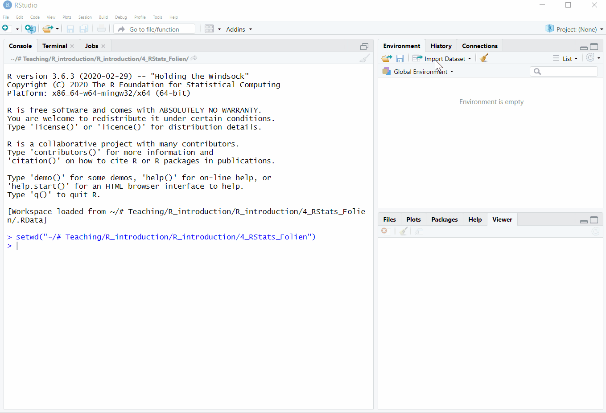
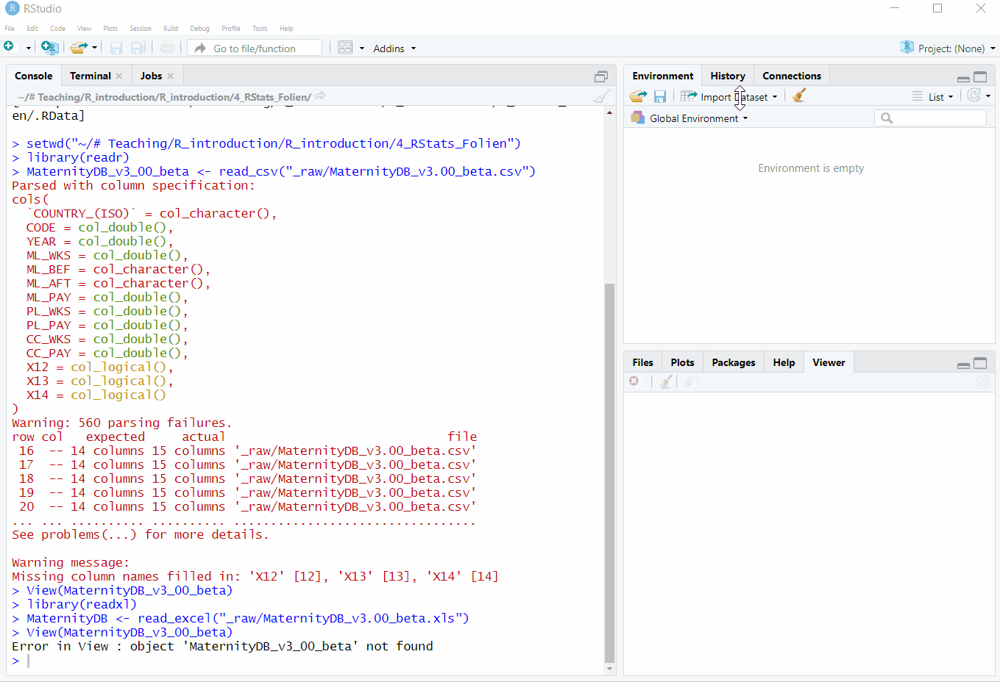

class: inverse, middle 
### Datenanalyse mit R
# # 4 Daten finden und importieren
### Tobias Wiß, Carmen Walenta und Felix Wohlgemuth
### 26.03.2020

---
# R Cheat Sheets
Die R Community hat für die wichtigsten Pakete und Funktionen Cheat Sheets erstellt. Cheat Sheets geben schnell einen Überblick über die wichtigsten Funktionen und wie man sie anwendet. 

https://rstudio.com/resources/cheatsheets/ 

Cheat Sheets zu den Themen, die wir bis jetzt behandelt haben:
* **Base R**: das Pakte `base` beinhaltet alle Grundfunktionen von R http://github.com/rstudio/cheatsheets/raw/master/base-r.pdf

* **Factors**: Umgang mit Faktoren in R https://github.com/rstudio/cheatsheets/raw/master/factors.pdf

* **data.table**: Guter Überblick über alle Themen, die wir letzte Woche behandelt haben (Dataframe erstellen; Zielen, Spalten einzelne oder mehrere Werte auswählen) https://github.com/rstudio/cheatsheets/raw/master/datatable.pdf

---
# Neues Projekt in R starten
Schritte am Anfang eines neuen Projektes in R:
1. Neue Session starten `Session > New Session`  
alternativ alle geladenen Elemente löschen mit `rm(list = ls())`
2. Neues R Skript erstellen
3. R Skript in Projektordner speichern
4. Projektordner als Working Directory setzen: 
* Entweder in RStudio `Session > Set Working Directory > To Source File Location` (das ist der Ordner mit dem R Skript)  
* Oder:
  - aktueller Dateipfad mit `getwd()` nachschauen
  - kopieren Sie den Dateipfad und adaptieren Sie ihn so, dass er zu ihrem Projektordner führt
  - Pfad zu Ihrem Projektordner in `setwd("ORDNERPFAD")` mit " " setzen und ausführen
---
# Neues Projekt in R starten
* Falls Sie die Working Directory per Befehlt festlegen, bitte nicht im R Skript speichern. Andere Personen die mit Ihrem R Skript arbeiten, haben nicht die gleiche Ordnerstruktur wie Sie.

* Falls Sie auf einem anderen Computer mit anderer Ordnerstruktur arbeiten, wird ihr `setwd()` im Skript nicht funktionieren.

* `rm(list = ls())` löscht alle Elemente. Andere Personen die mit Ihrem Skript arbeiten möchten das vielleicht nicht.
---
# Neues Projekt in R starten
In der R Community ist das ein kontroverses Thema:

Mehr Infos unter: https://www.tidyverse.org/blog/2017/12/workflow-vs-script/
---
# Übung "Daten und Datentypen"
Vielen Dank führ Ihre R Skripte! Sie machen alle gute Fortschritte.

Ein paar kleinere Punkte möchte ich nochmal hervorheben:
```{r uebung 2, echo=TRUE}
# Namen: Felix Wohlgemuth
# Uebung 3

# Wenn Sie charachter-Vektoren erstellen, 
# muessen sie die Werte in " " setzen
country <- c("LUX", "USA", "IRL")
social_exp <- c(22.4 , 18.7 , 14.4 )

# um mit dem Dataframen arbeiten zu können, 
# müssen Sie das Dataframe einem Objekt zuordnen
# hier dem Objekt "socx"
socx <- data.frame(country, social_exp)
```
---
# Übung "Daten und Datentypen"
```{r uebung 2 1, echo=TRUE}
# bitte rechnen Sie mit der Variable im Dataframe,
# und nicht mit dem Orginalvektor
# Änderungen am Dataframe  werden nicht im Orginalvektor gespeichert
# (zB Änderungen wie as.numeric() oder as.character() )
mean(socx$social_exp)

# Mit rm() können Sie Objekte löschen, die Sie nicht mehr brauchen
rm(country)
rm(social_exp)
# mit ls() sehen Sie die Objekte in Ihrer Environment 
ls()
# In RStudio sehen Sie die Objekte im Environment Fenster
```
---
# Was haben wir letzte Woche gelernt?
R kann mit einer Vielzahl von verschiedene **Objektklassen** arbeiten:
* reele Zahlen (numeric)
* ganze Zahlen (integer)
* Text (character)
* TRUE FALSE (logical)
```{r class, echo=FALSE}
country <- c("Österreich", "USA", "Deutschland")
soc_exp_gdp <- c(26.6, 18.7, 25.1)
fh_score <- c(93L, 86L, 94L)
eu <- c(TRUE, FALSE, TRUE)
socx <- data.frame(country, soc_exp_gdp, fh_score, eu)
socx$country <- as.character(socx$country)
```
```{r class 2, echo=TRUE}
str(socx)
```
---
# Was haben wir letzte Woche gelernt?
R arbeitet mit einer Reihe von **Datentypen**:
* Vektoren
* Matrizen
* Arrays
* Dataframes
* Listen  

**Vektoren** und **Dataframes** sind die zwei wichtigsten Typen für unseren Kurs
---
# Was haben wir letzte Woche gelernt?
**Vektoren** sind eine geordnete Folge von Werten: 
* Werte können alle einer Klasse entsprechen (sortenrein) oder gemischt sein. 
* Vektoren sind eindimensional und ihre Länge entspricht der Anzahl an Werten.  

** Faktoren** sind eine Sonderform von Vektoren mit Werten die nur vorab festgelegten Elementen entsprechen
* R speichert für jeden Wert eine ganze Zahl 
* Jeder ganzen Zahl ist ein Text (level) zugeordnet
* Die level sind geordnet
```{r type 1, echo=FALSE}
freedom_house <- factor(c("Partly Free", "Free", "Not Free", "Not Free", "Not Free", "Free", "Free", "Partly Free"),
                levels = c("Not Free", "Partly Free", "Free"))
```
```{r type 2, echo=TRUE}
str(freedom_house)
```
---
# Was haben wir letzte Woche gelernt?
**Dataframes** sind zweidimensional (wie eine Excel-Tabelle) mit Zeilen und Spalten:
* Jede Spalte ist eine Variable (zB alle Ländernamen im Datensatz)
* Jede Zeile ist eine Beobachtung (zB die Informationen zum Land, Jahreszahl und Sozialausgaben)
* Jede Zeile hat die gleiche Anzahl von Spalten
* Jede Spalte hat die gleiche Anzahl von Zeilen  

Der socx-Dataframe hat zB 3 Zielen = 3 Beobachtunge und 4 Spalten = 4 Variablen
```{r dataframe, echo=TRUE}
dim(socx)
```
---
# Was haben wir letzte Woche gelernt?
Bei der Erstellung von Dataframes mit `data.frame()`verknüpft R die Werte in den Vektoren anhand ihrer Position je Zeile.  
```{r dataframe 2, echo=TRUE, eval=FALSE}
country <- c("Österreich", "USA", "Deutschland")
soc_exp_gdp <- c(26.6, 18.7, 25.1)
fh_score <- c(93L, 86L, 94L)
eu <- c(TRUE, FALSE, TRUE)

socx <- data.frame(country, soc_exp_gdp, fh_score, eu)
```
Neue Zeilen werden mit `rbind()` dem Dataframe hinzugefügt. Der hinzugefügte Vektor = Zeile muss so viel Werte wir Spalten im Datensatz haben.
```{r dataframe 3, echo=TRUE, eval=FALSE}
NOR <- c("Norway", 25, 100 , FALSE)
socx <- rbind(socx, NOR)
```
Vorsicht, `rbind()`ändert die Objektklassen im Dataframe. Eine gute Alternative ist `add_row` aus dem tibble Paket.
---
# Was haben wir letzte Woche gelernt?
Um mit Variablen im Dataframe oder mit Werte im Dataframe arbeiten zu können, müssen Sie diese indizieren. Hierfür gibt es unterschiedliche Vorgehensweisen:
* Anhand der Position:
  * 3. Wert im Vektor "soc_exp_gdp": `soc_exp_gdp[3]`
  * 1. Wert der 3.Variable "fh_score" des Datenframes "socx": `socx[1,3]`
  * 1. & 3. Werte der 3.Variable im Dataframe: `socx[c(1,3),3]`
  * alle Werte außer des 2. Wertes der 4. Variable: `socx[-2, 4]`
* Anhand von logischen Bedingungen und die ganze Zeile: `socx[country == "USA", ]`
* Anhand von Variablennamen: `socx$country`  

Um die durschnittliche Sozialausgaben der Länder im Datensatz zu berechnen, müssen Sie dies in der Funktion `mean()`indizieren:
```{r indizieren, echo=TRUE}
mean(socx$soc_exp_gdp)
```
---
class: center, middle
Falls Sie noch Fragen haben, nutzen Sie das **Forum** auf moodle und unterstützen Sie Ihre Kolleg*innen mit Ihrem Wissen!  


Nutzen Sie auch unsere **R Sprechstunde**.  
Jeden Montag von 15:00 bis 15:30 auf zoom (link finden Sie in moodle).
---
# Daten finden
Bisher haben wir unsere Datensätze selbst auf Basis der OECD SOCX Daten erstellt. Es gibt einige freizugängliche Datensätze zu den unterschiedlichsten Aspekten von Familienpolitik im Ländervergleich.

| Database | Main topics | Source |
| -------- | ----------- | ------ |
| Comparative Familiy Policy Database | Allowances, Leave Policies | https://www.demogr.mpg.de/cgi-bin/databases/FamPolDB/index.plx |
| LIS Family Database | ECEC policies, Leave policies, Working time regulations | https://www.lisdatacenter.org/resources/other-databases/ |
| Multilinks Database | Allowances, ECEC policies, Leave policies | https://www.ggp-i.org/data/multilinks-database/ |
| Eurostat ESSPROS | Spending on ECE and benefits | https://ec.europa.eu/eurostat/en/data/database |
---
| Database | Main topics | Source |
| -------- | ----------- | ------ |
| OECD Family Database | ECEC policies, leave policies, Public spending on benefits and ECEC | http://www.oecd.org/social/family/database.htm |
| SPIN Database | Child benefits, ECEC policies, Leave policies | https://www.sofi.su.se/spin/ |
| The Work-Family Policy Indicators | ECEC policies, Leave policies, Working time regulations | https://www.lisdatacenter.org/resources/other-databases/?highlight=work%20famil%20policy%20indicators |
.footnote[Quelle: Lohmann, Henning, und Hannah Zagel. „Family Policy in Comparative Perspective: The Concepts and Measurement of Familization and Defamilization“. Journal of European Social Policy 26, Nr. 1 (Februar 2016): 48–65.] 
---
# Daten importieren
Mit unterschiedlichen Paketen können alle gängigen Datenformate in R importiert werden:
* Comma-Separated values **.csv**
* Excel **.xlsx** / **.xls**
* SPSS **.sav** 
* Stata **.dta** 
* RData **.rds** (ein Objekt)  / **.rdata** (mehrere Objekten)

Wir werden hauptsächlich mit .csv und .xls / .xlsx Daten arbeiten 
---
# Daten importieren
* Datensätze können in RStudio im Environment Fenster mit `Import Dataset` importiert werden oder per Befehlt direkt in der Konsole. Am Anfang ist es einfacher das Menü zu verwenden.  
* Speichern Sie aber trotzdem die Befehle in Ihrem R Skript (Copy-Paste aus der Konsole), um alle Schritte Ihrer Datenanalyse wiederholbar zu machen.

* R sucht beim Datenimport die Daten immer in Ihrer Working Directory. Deshalb ist es wichtig die Daten in Ihrem Projektordner abzuspeichern und die Working Directory auf den Projektordner zu setzen (siehe *Neues Projekt in R starten* Folien ).
---
# Daten importieren
**Comma-Separated values .csv**: 
* Textdateien mit Werten, die durch Kommas getrennt sind.
* Erste Zeile im Dokument sind Spaltenköpfe, also die Spaltennamen und somit die Variablennamen des zukünftigen Dataframes.
* Rechteckige Daten, d.h. alle Spalten haben gleichviele Zeilen und alle Zeilen haben gleichviele Spalten
* Dezimalstellen werden mit `.` getrennt
* Es gibt auch eine deutsche Version von .csv mit `,` als Dezimaltrenner und `;` als Trenner der Werte
---
# Daten importieren
**.csv Daten einlesen mit `read_csv()`**  
Der Befehl `read_csv()` ist Teil des `readr` Pakets und muss deshalb vorher geladen werden.  
```{r csv import 1, echo=TRUE, eval=FALSE}
library(readr)
# Die Struktur von read_csv ist simple 
# Sie müssen den Dateipfad mit " " in Klammern setzen
# Bei mir befinden sich Datensätze im _raw Ordner in 
# meinem Projektordner
MaternityDB_csv <- read_csv("_raw/MaternityDB_v3.00_beta.csv")
```

.footnote[Die Daten der Comparative Family Policy Database von Anne H. Gauthier sind auf https://www.demogr.mpg.de/cgi-bin/databases/FamPolDB/index.plx erhältlich.] 
---
# Daten importieren
**.csv Daten einlesen mit `read_csv()`**  

Falls Sie Fehlermeldungen bekommen, schauen Sie sich die Daten mit `view()` an und finden Sie die Fehlerquelle. In den Comparative Famiy Policy Database wurden leere Zeilen nach jedem Land von den Autor_innen eingefügt. Diese Zeilen mit nur NA Werten (missings) müssen später gelöscht werden.

Für Datensätzen mit deutscher Formatierung:  `read_csv2()`  

---
# Daten importieren
**.csv Daten einlesen per RStudio Menü**
* In RStudio gibt es eine grafische Oberfläche des `read_csv()` Befehls. 

* Wählen Sie `Import Dataset > From Text (readr)`. 

* In den neuem Fenster können Sie alle Einstellung treffen, die Sie auch per Befehl treffen können. 

* RStudio nimmt automatisch den Dateinamen als Namen für das Dataframe, unten links im Fenster können Sie das ändern. 

* Sie können auch im Fenster einstellen ob die Daten per `,` oder `;`getrennt sind.
---
class: center, middle 

---
# Daten importieren 
**.xls / .xlsx Daten einlesen**  

Für Excel-Dateien gibt es auch einen eigenen Befehl, der direkt in der Konsole oder mit einer grafischen Oberfläche in RStudio ausgeführt werden kann.

`read_excel` ist Teil des `readxl` Pakets und funktioniert ähnlich wie `read_csv`.
```{r xls 1, echo=TRUE, eval=FALSE}
library(readxl)
MaternityDB_xls <- read_excel("_raw/MaternityDB_v3.00_beta.xls")
```
---
# Daten importieren
**.xls / .xlsx Daten einlesen** 

Auch hier gab es ähnliche Fehlermeldungen aufgrund der leeren Zeilen, die von den Autor_innen des Datasets zur besser Übersicht eingefügt worden sind. Schauen Sie sich mit `view()` an wo die Fehler entstanden sind. 

Achten Sie auf die Struktur des Datensatzes, um Fehler beim Import zu vermeiden oder sie nach dem Import zu korriegieren. Eurostat-Datensätze haben zB öfters eine Überschrift am Anfang ihrer Tabellen. Hier müssen sie R mit `read("DATEI", skip = 5)` sagen wie viele Zeilen am Anfang des Dokumentes übersprungen werden müssen (hier 5). Die erste Zeile muss immer die Namen der Variablen enthalten.
---
# Daten importieren 
**.xls / .xlsx Daten per RStudio Menü**
* In RStudio gibt es eine grafische Oberfläche des `read_excel()` Befehls. 

* Wählen Sie `Import Dataset > From Excel`. 

* In den neuem Fenster können Sie alle Einstellung treffen, die Sie auch per Befehl treffen können (zB skip = 5)

* RStudio nimmt automatisch den Dateinamen als Namen für das Dataframe, im Code Preview Fenster können Sie das ändern. 
---
class: center, middle 

---
# Daten importieren
** .rds Daten importieren**
* R hat auch ein eigenes Datenformat, hier speichert R alle Attribute die bei anderen Formate verloren gehen.
* Zum Austausch von Daten ist es weniger geeignet, da Ihre Kolleg*innen nicht umbeding mit R arbeiten.
* In .rds kann nur ein Dataframe oder ein anderer Datentyp gespeichert werden.

.rds können mit `readRDS()` importiert werden. Es muss kein Pakte geladen werden, weil `readRDS()` Teil des base Pakets ist.
```{r rds 1, echo=TRUE, eval=FALSE}
MaternityDB_ <- readRDS("_raw/MaternityDB_r.rds") 
```
---
# Daten importieren
**.rdata Daten importieren**
* Eigenes R Datenformat
* Im Gegensatz zu .rds können in .rdata mehre Objekte gespeichert werden
* RStudion fragt am Ende ihrer Session, ob alle Objekte als .rdata gespeichert werden sollen

.rdata könne mit `load()` importiert werden. Da Sie R Objekte direkt laden, müssen sie die geladenen Daten keinem Objekt mit `<-` zuordnen.
```{r rdata, echo=TRUE, eval=FALSE}
load("_raw/Maternity_session2603.rdata")
```
---
# Daten importieren
**.rds / .rdata importieren per RStudio**  

Beide Dateiformate können direkt über das `File` Menü importiert werden

**.rds**
* `File > Open File` 
* .rds Datei auswählen und im neuen Fenster Objektnamen eingeben

**.rdata**
* `File > Open File` 
* rda. Datei auswählen
* alle gespeicherten Objekte werden direkt geladen
---
# Daten exportieren
**Dataframe in .csv speichern**
* Speichern Sie .csv daten immer in UTF-8-Kodierung (orginal Version von .csv).
* .csv Datein im deutschen Format könne beim Austausch Probleme machen.
* R speichert immer im Working Directory!

`write_csv` ist auch Teil des readr Pakets
```{r write csv, echo=TRUE, eval=FALSE}
# falls sie das Paket readr noch nicht geladen haben
library(readr)
# das müssen Sie aber nur einmal pro Skript machen

write.csv(MaternityDB, file = "data/MaternityDB.csv")
```
In der Klammer müssen Sie zuerst den R Objektnamen und dann in " " wo und mit welchen Namen Sie die Daten speichern wollen. Dateiendung .csv nicht vergessen!
---
# Daten exportieren
**Dataframe als .xlsx speichern**
* Generell speichern Sie Daten immer im .csv Format!
* Doch falls Sie jemand haben, der/die nur mit Excel arbeitet - zeigen Sie ihm/ihr R.
* Falls das nicht klappt, können Sie die Daten auch im Excel-Format speichern.

`write.xlsx` ist Teil des openxlsx Pakets
```{r write xlsx, echo=TRUE, eval=FALSE}
library(openxlsx)

write.xlsx(MaternityDB, file = "data/MaternityDB.xlsx", 
           sheetName = "Daten")
```
---
# Daten exportieren
**Dataframe als .rds speichern**
* Manchmal ergibt es Sinn, die Daten im R Format zu speichern.
* mit .rds können Sie einzelne Objekte wie ein Dataframe speichern.

`saveRDS` ist Teil des base Pakets, muss daher nicht geladen werden.
```{r write rds, echo=TRUE, eval=FALSE}
saveRDS(MaternityDB, file = "data/MaternityDB.rds")
```

**Mehre Datenobjekte als .rdata speichern**
* Wählen Sie die Objektnamen, die Sie speichern wollen und den Namen der neuen .rdata Datei.
```{r write rdata, echo=TRUE, eval=FALSE}
save(MaternityDB, country, NOR, 
     file = "data/Maternity_session2603.rdata")
```
---
# Übung
* Laden Sie von https://www.lisdatacenter.org/resources/other-databases/?highlight=work%20famil%20policy%20indicators den Datensatz "The Work-Family Policy Indicators (2012)" herunter (auf Indicators klicken).

* Importieren Sie den Excel Datensatz in R (Vorsicht Sie könnten `skip = ` gebrauchen).

* Untersuchen Sie den Datensatz mit `view()`, `dim()` und `str()`.

* Beschreiben Sie den Datensatz kurz als # Kommentar.

* Erläutern Sie kurz als # Kommentar was Sie am Datensatz ändern müssten, um damit arbeiten zu können.

* Speichern Sie den Datensatz als .csv Datei.

**Laden Sie ihr R Skript mit den Befehlen bis 02.04. 12:00 auf moodle hoch**
---
class: center, middle
Falls Sie noch Fragen haben, nutzen Sie das **Forum** auf moodle und unterstützen Sie Ihre Kolleg*innen mit Ihrem Wissen!  


Nutzen Sie auch unsere **R Sprechstunde**.  
Jeden Montag von 15:00 bis 15:30 auf zoom (link finden Sie in moodle).
