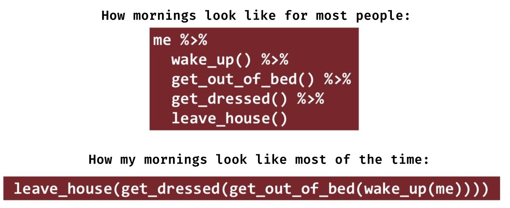
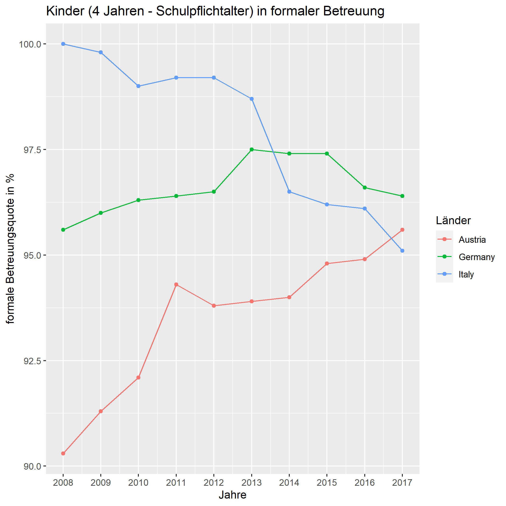
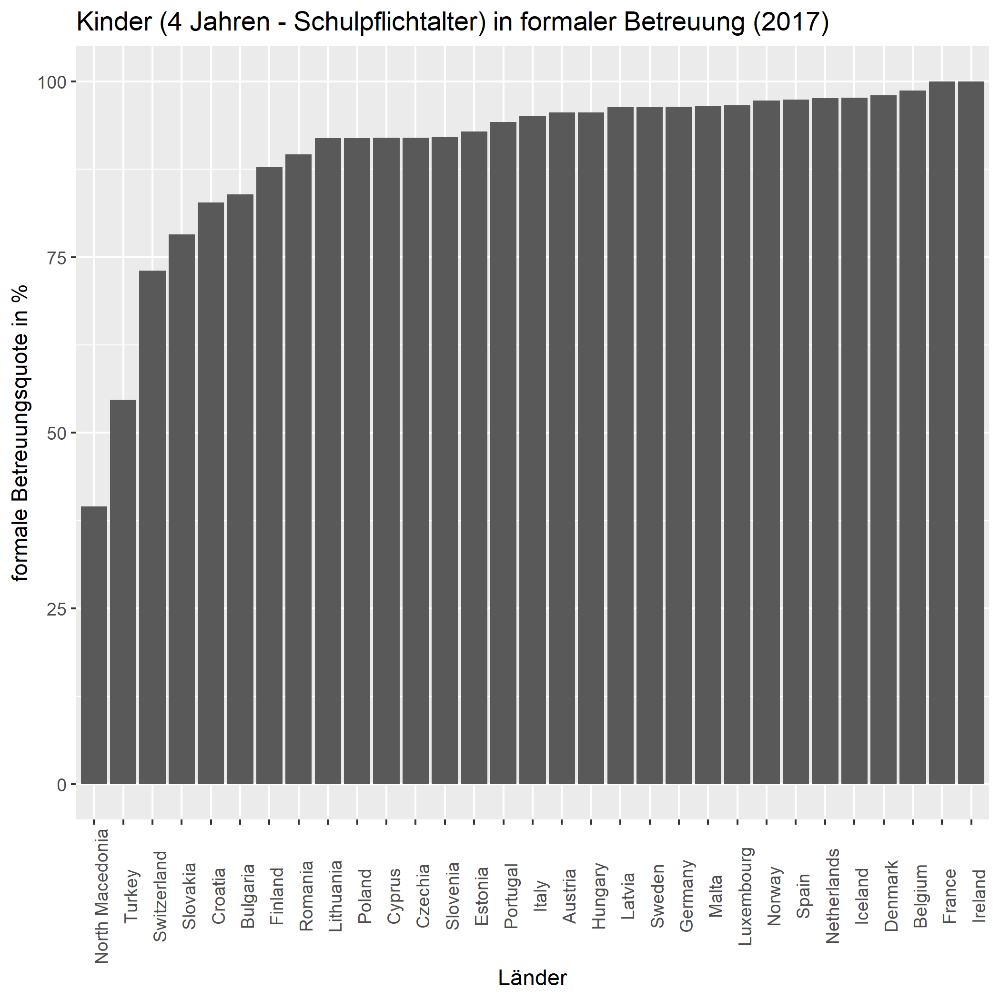

class: inverse, middle 
### Datenanalyse mit R
# # 6 Daten aufbereiten
### Tobias Wiß, Carmen Walenta und Felix Wohlgemuth
### 02.04.2020

---
class:inverse, middle 
# 6 ist das neue 5
## Die 5.Sitzung wäre das Mittwochskolloquium mit Julian Garritzmann gewesen. Um die Struktur des Syllabus einzuhalten, überspringen wir die 5.Sitzung. Inhaltlich knüpfen wir direkt an die letzte Woche an.  

Julian Garritzmann arbeitet auch mit R. Er veröffentlicht seine Daten als .rds und seine R Skripte. Sie können seine lezte Publikation einfach nachbauen: https://ejpr.onlinelibrary.wiley.com/doi/full/10.1111/1475-6765.12371 (Supporting Information am Ende der Seite)
---
# Übung 4
Danke für Ihre Skripts und auch Danke, dass Sie sich an der Forumsdiskussion beteiligt haben! Ich hoffe Sie konnten alle eine Lösung für ihr Problem finden.  

Das ist eine Möglichkeit die Übung 4 zu machen:
```{r uebung4 1, echo=TRUE, eval=FALSE}
# Uebung 4
# Felix Wohlgemuth

# Work-Family Policy Indicators laden
# Die 1.Zeile muss die Variablennamen enthalten deshalb skip = 4
library(readxl)
wfpi <- read_excel("_raw/resources-other-work-family-policy-indicators.xls"
                  , skip = 4) 
```
---
#  Übung 4
```{r uebung4 2, echo=TRUE, eval=FALSE}
# wfpi dataframe untersuchen
View(wfpi)
dim(wfpi)
str(wfpi)

# Der Datensatz besteht aus 13 Variablen 
# zu unterschiedlichen Aspekten von Familienpolitik

# 23 Beobachtungen jeweils ein Land-Jahr
# (und 2 zusätzliche Zeilen die keine Beobachtung sind)

# R hat die meisten Variablen richtig als 
# numerische Variablen importiert
```
---
# Übung 4
```{r uebung4 3, echo=TRUE, eval=FALSE}
# Änderungen die notwendig sind:

## Aus variable ...1 zwei Variablen machen: country & year

## Variablennamen kürzen und anstatt Leerzeichen Unterstriche

## Zwei numerische Variablen wurden falsch als character importiert 
## die müssen umgewandelt werden

## Zeile 23 -24 sind keine Beobachtungen sondern Fussnoten
## müssen gelöscht werden
```
Die Bearbeitung von Datensätzen, um damit im nächsten Schritt arbeiten zu können, ist das heutige Thema!
---
# Übung 4
```{r uebung4 4, echo=TRUE, eval=FALSE}
# normalerweise hätten wir jetzt die Änderungen durchgeführt
# und hätten jetzt einen Datensatz mit dem man besser arbeiten kann

# Dann speichern wir die Daten als .csv Datei
library(readr)
write_csv(wfpi, "data/wfpi_270320.csv")
```
---
# Was haben wir letzte Woche gelernt?
**Daten importieren: .csv**
* Daten werden hauptsächlich im .csv Format geteilt .
* In .csv Dateien sind Werte per `,` geteilt (eventuell in der deutschen Formatierung per `;`).
* .csv Daten werden mit `read_csv()` in R importiert (`read_csv2()` wenn `;` - Formatierung).
* Alternativ kann auch die grafischen Oberfläche in R genutzt werden, aber Befehle ins R Skript kopieren und speichern!
* R sucht Daten zuerst in der Working Directory, daher zuerst Working Directory auf Projektordner festlegen.
```{r csv 1, echo=TRUE, eval=FALSE}
library(readr)

MaternityDB <- read_csv("_raw/MaternityDB_v3.00_beta.csv")

# Als Alternative gibt es im base Paket read.csv() und read.csv2()

MaternityDB <- read.csv("_raw/MaternityDB_v3.00_beta.csv")

# read_csv() ist schneller als read.csv()
```
---
# Was haben wir letzte Woche gelernt?
** Daten exportieren: .csv**
* Um Ihr Dataframe zu teilen, speichern Sie es am besten als .csv Datei ab.
* Sie können ein einzelnes Dataframe als Tabelle in .csv Formatierung exportieren.
* R speichert immer in der Working Directory.
```{r csv 2, echo=TRUE, eval=FALSE}
library(readr)

write_csv(MaternityDB, "output/MaternityDB_230320.csv")

# Alternativ write.csv() aus dem base Paket

write.csv(MaternityDB, file = "output/MaternityDB_230320.csv")
```
---
# Was haben wir letzte Woche gelernt?
**Daten importieren: .xls / .xlsx**
* R kann auch Excel-Daten importieren.
* Die erste Zeile muss immer die Spaltennamen enthalten (falls R beim einlesen Zeilen überspringe soll, nutzen Sie `skip = `).
* Auch hier gibt es eine grafischen Oberfläche --> Befehle im R Skript speichern.
```{r xls, echo=TRUE, eval=FALSE}
library(readxl)

wfpi <- read_excel("_raw/resources-other-work-family-policy-indicators.xls", skip = 4)
```

Am besten sind aber .csv Dateien mit R kompatibel. Falls Sie Probleme mit .xls und .xlsx Daten in R haben, können Sie die Excel Tabelle auch außerhalb R für den Import vorbereiten. Öffnen Sie die Tabelle in Excel oder einem anderen Tabellenkalkulationsprogramm. Ändern sie die Tabelle, so dass die erste Zeile alle Spaltennamen enthält. Speichern Sie die Tabelle als .csv. Das neue Dateiformat sollte ohne Probleme in R importierbar sein. Sie sollten Ihre Schritte notieren. Wenn Sie es im R Skript machen, können Sie jeden Ihrer Schritte nachvollziehen. In Excel nach ein paar Wochen vielleicht nicht mehr. 
---
# Was haben wir letzte Woche gelernt?
**Daten exportieren: .xls / .xlsx**
* Ich empfehele Ihnen speichern Sie Ihre Dataframes nie als Excel Dateien!
* Aber mit den `openxlsx` Paket ginge es.
```{r xls 2, echo=TRUE, eval=FALSE}
library(openxlsx)
write.xlsx(MaternityDB, file = "data/MaternityDB.xlsx",
           sheetName = "Daten")
```
---
# Was haben wir letzte Woche gelernt?
**Daten importieren: .rds / .rdata**
* R hat auch eigene Dateiformate um Daten zu speichern.
* Nur eingeschränkt zum Teilen verwendbar, außer alle Ihrer Kolleg*innen arbeiten mit R.
* .rds beinhaltet nur ein Objekt (zB Dataframe).

```{r rds, echo=TRUE, eval=FALSE}
MaternityDB <- readRDS("_raw/MaternityDB_r.rds")
```

* In .rdata können mehre Objekte gespeichert werden.
* Sie laden gleichzeitig mehrere Objekte (zB Dataframes, Vektoren, Listen ...).
```{r rdata, echo=TRUE, eval=FALSE}
# Sie laden die Objekte direkt ohne <-
load("_raw/Maternity_session2603.rdata")
```
---

# Was haben wir letzte Woche gelernt?
**Daten exportieren: .rds / .rdata**
* Einzelne Objekte (zB Dataframes) können Sie in einer .rds Datei speichern.
```{r rds 2, echo=TRUE, eval=FALSE}
saveRDS(MaternityDB, file = "data/MaternityDB.rds")
```
* Mehre Objekte (zB alle Objekte die Sie in Ihrer Sessions erstellt haben) können Sie in einer .rdata Datei speichern.
* RStudio fragt Sie am Ende Ihrer Session, ob Sie die geladenen Objekte Ihrer Session als .rdata speichern wollen.
```{r rdata 2, echo=TRUE, eval=FALSE}
save(MaternityDB, country, NOR, file = "data/Maternity_session2603.rdata")
```
---
class: inverse, middle 
# # 6 Daten aufbereiten
---
# Daten aufbereiten mit dplyr 
* `dplyr` ist Teil des `tidyverse`.
---
class:centre, middle 
```{r tidyverse, echo=FALSE, out.width = "65%", fig.pos= 'h'}

```
.footnote[Source: R Memes for Statistical Fiends https://www.reddit.com/r/rstatsmemes/]
---
# Daten aufbereiten mit dplyr 
* `dplyr` ist Teil des `tidyverse`.

* Basiert auf den Grundprinzipien: 
  * Komplexe Datenaufbereitung kann in wenige **Grundbausteine** zerteilt werden.
  * **pipes `%>%`** funktionieren als Verknüpfung der Grundbausteine und können übersetzt werden mit "UND DANN" oder "Nehme das resultierende Dataframe aus der vorherigen Funktion und wende das Folgende darauf an".
  
* Befehle aus `dyplr` sind für die Arbeit mit Dataframes entwickelt: 
  * Sie erwarten Dataframes und geben Dataframes aus.
  * *Eigentlich sind es es tibbles, eine Art von Dataframe (Mehr Infos: https://r4ds.had.co.nz/tibbles.html)*.
---
# Daten aufbereiten mit dplyr
* Um mehrere Funktionen ohne Zwischenergebnisse in R durchzuführen, müssen Funktionen in (Funktionen) geschrieben werden.
* Mit `%>%` können Befehle hintereinander gereiht werden.

* Vor der ersten `%>%` muss spezifiziert werden auf welchen Dataframe sich die nachfolgende Funktionen beziehen (hier: me).


```{r pipes, echo=FALSE, out.width = "80%"}

```

.footnote[Source: R Memes for Statistical Fiends https://www.reddit.com/r/rstatsmemes/]
---
# Daten aufbereiten mit dplyr
Wenn `tidyverse` geladen wird, werden die wichtigsten Pakete aus dem tidyverse- Universum geladen (zB `readr`, `dplyr`, `ggplot2`).
```{r tidyverse 2, echo=TRUE}
library(tidyverse)
```
---
# Daten laden mit readr::read_csv
Heute verwenden wir Eurostatdaten zu Quoten von Kindern in formaler Betreuung (4 Jahre - Schulalter).


Datensatz: *eurostat [educ_uoe_enra10] Pupils aged between 4 years old and the starting age of compulsory education, by sex - as % of the population of the corresponding age group
http://ec.europa.eu/eurostat/product?code=educ_uoe_enra10&language=en&mode=view*  

```{r load data 1, include=FALSE}
# Daten laden
ece_org <- readr::read_csv("_raw/educ_uoe_enra10_1_Data.csv")
```
```{r load data 2, echo=TRUE, eval=FALSE}
# Daten laden
ece_org <- readr::read_csv("_raw/educ_uoe_enra10_1_Data.csv")
```

.footnote[*(Um Funktionen aus einem Paket zu verwenden, müssen Sie das Paket mit `library(readr)` vorher laden. Sie können aber auch die Funktion ohne das Paket zu laden mit `readr::read_csv` verwenden. Es gibt Funktionen wie zB `recode()`deren Namen von mehreren Paketen verwendet werden. Mit `dplyr::recode()` können Sie die Funktion genau benennen)*]
---
# Daten aufbereiten mit select()
Als ersten Schritt sollten Sie sich immer die Daten genau anschauen. Gute Funktionen hierfür sind `str()`, `dim()` und in RStudio `View()`.
```{r select 1, echo=TRUE, eval=TRUE}
str(ece_org)
```
---
# Daten aufbereiten mit select()

Mit `str()` sind schon ein paar der nächsten Schritte erkennbar:
* Es gibt Variablen die wir nicht brauchen wie `SEX` und `UNIT`.  
*(Eurostat produziert die 2 Variablen automatisch, hätten wir unterschiedliche Altersklassen ausgewählt oder die Betreuungsquote zB in absoluten Zahlen, bräuchten wir die zwei Variablen.)*
* Die Betreuungsquoten befinden sich in `Value`, das sollte im Variablennamen auch schnell erkennbar sein.
* `Value` ist ein character vector.  Die Werte sind eigentlich numerisch.
* Es gibt ein paar Werte in `GEO` die keine Länder sind (zB EU).
* Haben wir für alle Länder die Betreuungsquotendaten für die gleichen Jahre?
---
# Daten aufbereiten mit select()

Mit `select()` können wir alle Variablen (Spalten), die wir auch wirklich brauchen, in einem neuen Dataframe speichern:
* Der Vorteil mit `select()` aus dplyr ist, dass wir mit dem Variablennamen arbeiten können.
* Der Funktion kann entweder mit oder ohne `%>%` durchgeführt werden:
```{r select 2, echo=TRUE}
# Nur notwendinge Variablen auswählen mit select()
ece <- select(ece_org, TIME, GEO, Value)

# Kann auch mit %>% geschrieben werden
ece <- ece %>%
  select(TIME, GEO, Value)

# Per - kopiert select alle Variablen außer die Ausgewählten
ece <- select(ece_org, -SEX, -UNIT)
```
---
# Daten aufbereiten mit filter()
In der Variable `GEO` befinden sich nicht nur Länder, sondern auch kumulierte Werte für die EU. Für den Ländervergleich benötigen wir diese Werte nicht.
```{r filter 1, echo=TRUE, eval=TRUE}
# unique() zeigt alle Ausprägungen der Variable
unique(ece$GEO)
```
---
# Daten aufbereiten mit filter()
Wie immer in R gibt es unterschiedliche Schreibweisen die zum gleichen Ergebnis führen.
```{r filter 2, echo=TRUE, eval=TRUE}
ece <- filter(ece, 
                  GEO != "European Union - 27 countries (from 2020)" & 
                  GEO != "European Union - 28 countries (2013-2020)")
ece <- ece %>%
  filter(! GEO %in% 
           c("European Union - 27 countries (from 2020)", 
             "European Union - 28 countries (2013-2020)"))
```
Zur Erinnerung:
* `!=` heißt in R ungleich, also nimmt `filter()` alle Zeilen außer die Zeilen, welche die zwei EU-Bezeichnungen beinhalten.
* `&` ist *und*  `|` ist *oder* 
* Mit `!` (gesprochen NOT) kann eine logischen Aussage "umgedreht" werden.
* `%in%`  filtert mit Elementen aus einer Menge `c()`.
---
# Daten aufbereiten: Variablen manipulieren

Der große Vorteil von `%>%` ist, dass man mehrere Funktionen hintereinander setzen kann. Die Funktion nach `%>%` arbeitet mit dem Dataframe das aus der vorherigen Funktion resultiert. Damit machen wir mehrere Schritte in einem Befehl:
* Mit `rename()` benennen wir unsere Hauptvariable um.
* Mit `mutate()` erstellen wir eine neue Variable, da die aber so heißt wie unsere Hauptvariable wird diese überschrieben.
* Mit `as.numeric()` überschreiben `ece_o4y` mit einer numerischen Version derselben Variable.
* Bei der Änderung zu einer numerischen Variable werden alle Werte die keine Zahl sind als `NA` gesetzt (im Original waren fehlende Werte mit `:` definiert).
* Mit `drop_na()` löschen wir alle Zeilen, also Länder-Jahre, die keinen Wert für die Betreuungsquote haben.
* Als wir mit `unique()` die Ländernamen angeschaut haben, haben wir gesehen, dass es einen Ländernamen mit Leerzeichen gibt. R arbeitet am besten wenn character-Werte und Objektnamen nur aus Buchstaben, `_` und Zahlen (nicht als erstes Zeichen) bestehen. 
  

---
# Daten aufbereiten: Variablen manipulieren
```{r manipulate, echo=TRUE}
ece <- ece %>%
  rename(ece_o4y = Value) %>%
  mutate(ece_o4y = as.numeric(ece_o4y)) %>%
  drop_na(ece_o4y) %>% 
  mutate(GEO = recode(GEO, "Germany (until 1990 former territory of the FRG)" = "Germany"))
```
---
# Daten aufbereiten: Daten sortieren & strukturieren
Für die Datenanalyse ist es egal in welcher Reihenfolge die Zeilen oder Spalten sind. Aber manchmal ist es doch einfacher wenn der Datensatz alphabetisch, absteigend oder aufsteigend angeordnet ist. 

`arrange()` kann mit mehreren Variablennamen arbeiten. Es ordnet zuerst nach der ersten Variable und dann nach der zweiten Variable, d.h. alle gleichen Werte der ersten Variable werden nach der zweiten Variable angeordnet. Hier zuerst alphabetisch nach dem Ländernamen `GEO` dann aufsteigend nach der Jahreszahl `TIME`.
```{r arrange, echo=TRUE}
# Nach Ländernamen und Jahren sortieren
ece <- ece %>%
  arrange(GEO, TIME)
```
---
# Daten aufbereiten: Gruppieren & Zusammenfassen
Beim Blick über die Daten gibt es erste Anzeichen, dass nicht alle Länder Daten für alle Jahre im Sample haben. Um jedes Jahr vergleichen zu können, brauchen wir einen Datensatz der für jedes Jahr Daten für alle Länder hat.
* Mit `group_by()` wird der Datensatz je Land gruppiert.
* Alle folgende Berechnung werden innerhalb der Gruppen angewendet.
* Mit `summarise()` können unterschiedliche Kennzahlen berechnet werden:
  * Wird vorher nicht gruppiert wird die Kennzahl für das ganze Datenframe berechnet. 
  * Wird vorher gruppiert wird pro Gruppe die Kennzahl berechnet.
---
# Daten aufbereiten: Gruppieren & Zusammenfassen
```{r summarise, echo=TRUE}
# für welche Jahre haben wie Daten pro Jahr?
sum_ece <- ece %>% 
  group_by(GEO) %>%
  summarise(min_year = min(TIME), 
            max_year = max(TIME), 
            range_year = (max(TIME) - min(TIME)), 
            n_observations = n()) %>%
  arrange(n_observations) %>%
  ungroup()
```
`summarise()` funktioniert auch mit `mean()`.
---
# Daten aufbereiten: Gruppieren & Zusammenfassen
```{r summarise 2, echo=TRUE}
sum_ece
```
---
# Daten aufbereiten: Gruppieren & Zusammenfassen
```{r summarise 3, echo=TRUE}
# nur Länder mit 10 Beobachtungen von 2008 bis 2017 behalten
ece <- ece %>%
  group_by(GEO) %>%
  mutate(n_observations = n()) %>%
  filter(n_observations == 10) %>%
  select(-n_observations) %>%
  ungroup()
```
---
# tidy Data
Für Datenanalyse benötigt es tidy data (= aufgeräumte Datensätze): 
* Jede Spalte hat einem Variablennamen und alle Spalten haben die gleiche Länge (rechteckiges Dataframe).
* Jede Zeile ist eine eine Beobachtung (zB Länder-Jahr) und jede jede Spalte eine Variable.
* Fehlende Werte sind als missing definiert (NA).
* Daten sind nicht von Hand kodieren, sondern nachvollziehbar mit R Skripten.
* Variablennamen sind ohne Sonderzeichen und Leerzeichen  
NUR ZIFFERN, BUCHSTABEN oder UNTERSTRICHE
* Variablennamen beginnen nicht mit einer Zahl.
---
# tidy Data
**Jede Zeile eine Beobachtung, jede Spalte eine Variable, jede Zelle ein Wert**.


```{r tidy, echo = FALSE, out.width = "90%", fig.pos= 'h'}
knitr::include_graphics("figures/tidy-1.png ")
```

.footnote[Source: https://r4ds.had.co.nz/tidy-data.html]
---
# Nächste Schritte
Mit tidy Daten können wir als nächstes zB den zeitlichen Verlauf der Betreuungsquote von ausgewählten Ländern visualisieren:
```{r visual 1, echo=TRUE}
plot1 <- ece %>%
  filter(GEO %in% c("Austria", "Germany", "Italy")) %>%
  ggplot(aes(x = TIME, y = ece_o4y)) +
  geom_line(aes(group = GEO, colour = GEO)) + 
  geom_point(aes(colour = GEO)) +
  scale_x_continuous(breaks = unique(ece$TIME)) +
  labs(title = "Kinder (4 Jahren - Schulpflichtalter) in formaler Betreuung",
       y = "formale Betreuungsquote in %",
       x = "Jahre", 
       colour = "Länder")
ggsave(filename = "plot1.png", path = "output" )
```
---
class: centre, middle
```{r visual 2, echo=FALSE,  out.width = "80%", fig.pos= 'h' }

```
---
# Nächste Schritte
oder die Betreuungsquote aller Länder im Jahr 2017 vergleichen:
```{r visual 3, echo=TRUE}
plot2 <- ece%>%
  filter(TIME == 2017) %>%
  ggplot(aes(x = reorder(GEO, ece_o4y), y = ece_o4y)) +
  geom_bar(stat = "identity") +
  labs(title = "Kinder (4 Jahren - Schulpflichtalter) in formaler Betreuung (2017)",
       y = "formale Betreuungsquote in %",
       x = "Länder") +
  theme(axis.text.x = element_text(angle = 90))
ggsave(filename = "plot2.png", path = "output" )
```
---
class: centre, middle
```{r visual 4, echo=FALSE,  out.width = "80%", fig.pos= 'h' }

```
---
# Übung 6 (6 ist das neue 5)
* Laden Sie von moodle den OECD Datensatz "SOCX_AGG_31032020142101957.csv" herunter.  
* Bearbeiten Sie den Datensatz, so dass Sie ein tidy dataset bekommen.
* Berechnen Sie die durchschnittlichen Ausgaben für Familienpolitik in Österreich im Zeitraum 2000 - 2015.
* Welche fünf Länder haben im Jahr 2010 am meisten für Familienpolitik ausgegeben (in % des BIPs)?
* Speichern Sie die Ergebnisse als # Kommentar im Skript.
* Ihr R Skript sollte alle verwendeten Funktionen beinhalten (lassen Sie ihr fertiges R Skript am Ende nochmal komplett durchlaufen. Falls Sie einen Fehler erhalten, beheben Sie diesen).

**Laden Sie Ihr R Skript bis spätestens 22.04. 12:00 auf moodle hoch** 