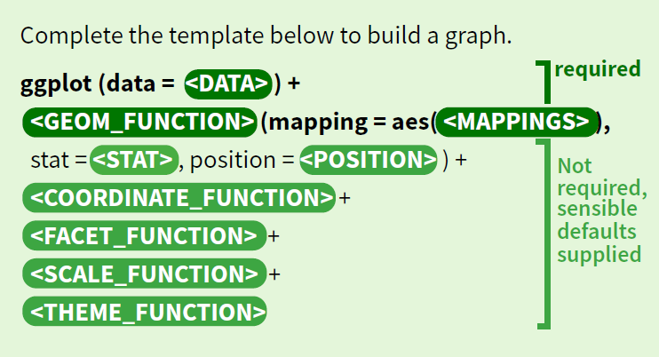

class: inverse, middle 
### Datenanalyse mit R
# # 8 Visualisierungen mit ggplot2
### Tobias Wiß, Carmen Walenta und Felix Wohlgemuth
### 23.04.2020

---
# Neuer Ablauf des R-Teils ab heute
Ab heute hat der R-Teil einen neuen Ablauf. Nochmal kurz zusammengefasst:

| Wann?                                                                     | Was passiert?                            |
| :------------------------------------------------------------------------ | :--------------------------------------- |
| Freitag Abend (Woche vor der Sprechstunde)                                | neue Folien und Übungsaufgabe auf moodle |
| Donnerstag 11:00 oder im Anschluss an die zoom-Sitzung zu Familienpolitik | R-Sprechstunde                           |
| Freitag 12:00 (Tag nach der Sprechstunde)                                 | Abgabe Übungsaufgabe auf moodle          |
| Freitag 13:00  (Tag nach der Sprechstunde)                                | Lösungsskript wird veröffentlicht        |

Das Lösungsskript für die optionale Übung 7 ist ab Mittwoch 13:00 auf moodle. Ich werde Ihnen auch ein kurzes Feedback über moodle per Kommentar zu Ihrer Abgabe geben. 
---
class: center, middle
Falls Sie noch Fragen haben, nutzen Sie das **Forum** auf moodle und unterstützen Sie Ihre Kolleg*innen mit Ihrem Wissen!  


Nutzen Sie auch unsere **R Sprechstunde**.  
Jeden Donnerstag von 11:00 bis 11:45 auf zoom oder im Anschluss an die zoom-Sitzung zu Familienpolitik (Link finden Sie auf moodle).
---
class: inverse, middle, centre
# Was haben wir letzte Woche gelernt?
## Deskriptive Statistik: Einzelvariablen
---
# summarise()
`summarise()` ist die Grundfunktion von `dplyr` für die Berechnung von deskriptiven Maßen:
* `summarise()` fasst eine Variable im Dataframe zu einem oder mehreren Werten zusammen.
* `summarise()` berechnet Lagemaße und auch Streuungsmaße, wie zB<sup>1</sup>:
  * Center: mean(), median()
  * Spread: sd(), IQR(), mad()
  * Range: min(), max(), quantile()
  * Position: first(), last(), nth(),
  * Count: n(), n_distinct()
* In `summarise` können Sie auch eigene Maße berechnen, die auf diesen Funktionen basieren (zB die Differenz des Durchschnitts einer Variable und dem Durchschnitt einer zweiten Variable).
* `summarise()` ist Teil des `dplyr`-Pakets, d.h. es ist kompatibel mit `%>%`, berücksichtigt `group_by` und gibt ein Dataframe aus.


.footnote[
[1] In der Lektüre zur heutigen Sitzung werde die Lagemaße und Streuungsmaße nochmal genau erläutert. Bitte schauen Sie in Sauer: S. 103-112 nach, falls Ihnen die Bedeutungen nicht ganz klar sind.]
---
# summarise() - Syntax
* Das Dataframe mit den Variablen muss festgelegt werden. Entweder am Anfang per `%>%` oder in `summarise()` an erster Stelle.
* `summarise()` berücksichtigt `group_by()`.
* Innerhalb von `summarise()`:
  * Dataframe definieren außer es werden ` %>% ` verwendet.
  * Namen des Maßes definieren (zB `mean_services =`).
  * Funktion definieren (zB `mean_services = mean()`).
  * Variable definieren auf die sich die Funktion bezieht (zB `mean_services = mean(family_service_total_pct_gdp)`).
* Output ist ein dataframe mit den festgelegten Maßen als Variablen.  Wenn vorher gruppiert wurde, dann sind die Werte der gruppierten Variable die Zeilen im Dataframe (zB Länder).
---
# summarise() - Syntax Beispiel
```{r summarise 1a, include=FALSE}
library(tidyverse)
socx_data <- read_csv("_raw/SOCX_AGG_20042020191205895.csv")
```
```{r summarise 1b, eval=FALSE}
library(tidyverse)
socx_data <- read_csv("_raw/SOCX_AGG_20042020191205895.csv")
```
```{r summarise 1c}
socx_data %>%
  filter(YEAR >= 2000 & YEAR <= 2015) %>%
  group_by(COUNTRY) %>% 
  summarise(mean_services = mean(family_service_total_pct_gdp),
            sd_services = sd(family_service_total_pct_gdp))
```
---
class: center, middle
Falls Sie noch Fragen haben, nutzen Sie das **Forum** auf moodle und unterstützen Sie Ihre Kolleg*innen mit Ihrem Wissen!  


Nutzen Sie auch unsere **R Sprechstunde**.  
Jeden Donnerstag von 11:00 bis 11:45 auf zoom (Link finden Sie auf moodle).
---
class: inverse, middle, centre
# Visualisierungen mit ggplot2
---
# Visualisieren in R
Um Daten in R zu visualisieren kann `plot()` aus den Grundfunktionen genutzt werden (mehr Infos unter https://www.statmethods.net/graphs/creating.html).

Wir werden aber das ggplot2 Paket aus der tidyverse Welt nutzen.  
(Wenn Sie `library(tidyverse)` laden dann wird automatisch ggplot2 geladen).

ggplot2 hat den Vorteil, dass wir innerhalb eines Befehls per `+` eine Ebene nach der anderen auf unsere Plot auftragen können. Mit `plot()` müssten wir mit mehreren Funktionen hintereinander den Grundplot spezifizieren. Mit ggplot2 kann das übersichtlicher gemacht werden. ggplot2 verwendet leider keine `%>%` sondern `+` zwischen den Ebenen.  

*Falls Sie sich fragen was mit ggplot1 passiert ist und warum ggplot2 keine `%>% ` verwendet, dann schauen Sie sich den Vortrag des Entwicklers des tidyverse an https://youtu.be/vYwXMnC03I4?t=112 - Sogar die aktivsten R Entwickler_innen machen einige Fehler.*
---
# ggplot2 - Syntax
Um einen besser Überblick über die unterschiedlichen Bausteine von ggplot2 zu bekommen, öffnen Sie das ggplot2 cheatsheet von RStudio https://github.com/rstudio/cheatsheets/blob/master/data-visualization-2.1.pdf 

```{r ggplot2 syntax, echo=FALSE, out.width = "80%", fig.align='center'}

```
---
# ggplot2 - Syntax ggplot()
Um einen Plot zu erstellen ist die erste Zeile immer:

`ggplot(data = <DATAFRAMENAMEN>)`

Hier wird ggplot gesagt in welchem Dataframe sich die Variablen für den Plot befinden und es wird die erste Ebene der Plots erstellt. Da aber noch keine Variablen festgelegt wurden, ist der Plot leer.
```{r load 1a, include=FALSE}
library(tidyverse)
socx_data <- read_csv("_raw/SOCX_AGG_20042020191205895.csv")
```
```{r load 1b, eval=FALSE}
library(tidyverse)
socx_data <- read_csv("_raw/SOCX_AGG_20042020191205895.csv")
```
*Ich speichere den Plot in dem Objekt plot1. Wenn Sie das nicht machen, dann wird der Plot in RStudio rechts unten im Viewer angezeigt. Mit Klick auf Zoom wird der Plot in einem neuen Fenster größer angezeigt und mit Export wird der Plot gespeichert.* 
```{r ggplot 1a}
plot1 <- ggplot(data = socx_data)
```
---
# ggplot2 - Syntax ggplot()
```{r ggplot 1b, out.width = "50%", fig.align='center'}
print(plot1)
```  

Ohne Variablen ist der Plot komplett leer, aber darauf werden die nächsten Ebenen aufgebaut.
---
# ggplot2 - Syntax geom_function()
Eine weitere Ebene wird per `+` nach der vorherigen Zeile hinzugefügt.

`geom_function()` als verpflichtende zweite Zeile steht für alle unterschiedlichen Plottypen, die ggplot2 erstellen kann. 
Wir erstellen mit `geom_point()` ein Scatterplot der Ausgaben für Familienpolitik je Jahr. Also auf der x-Achse die Jahre und auf der y-Achse die  Ausgaben für Familienpolitik in % BIP. 

Die Variablen werden im `mapping = ` Teil der `geom_function()` spezifiziert. Die x- und y-Achse sind sogenannte aesthetics und müssen innerhalb von `aes()` benannt werden.
```{r geom_point 1}
plot1 <- ggplot(data = socx_data) +
  geom_point(mapping = aes(x = YEAR, y = family_total_total_pct_gdp))
```
---
# ggplot2 - Syntax geom_function()
```{r geom_point2, out.width = "50%", fig.align='center'}
plot1
```
---
# ggplot2 - Syntax geom_function()
Dabei werden automatisch zwei Achsen erstellt. Skalierung und Achsennamen werden auch automatisch erstellt. Alles kann aber nach unserem Wunsch überschrieben werden. Dazu mehr nächste Woche. 

Die Fehlermeldung informiert uns, dass 3 fehlende Werte nicht angezeigt werden. D.h. uns fehlende drei Länder-Jahre im Plot. Wir hätten vorher den Datensatz mit `drop_na()` bereinigen können.

Da `ggplot` Teil des `tidyverse` ist können wir den Datensatz per `%>%` festlegen und vorher Änderungen durchführen (`drop_na()` aber auch `filter()`). Dann müssen wir `data = ` nicht mehr festlegen.
```{r geom_point 3}
plot1 <- socx_data %>%
    drop_na(family_total_total_pct_gdp) %>%
  ggplot() +
    geom_point(mapping = aes(x = YEAR, y = family_total_total_pct_gdp))
```
---
# ggplot2 - Syntax geom_function()
```{r geom_point3 a, out.width = "50%", fig.align='center'}
plot1
```
---
# ggplot2 - Syntax aesthetics
Was sehen wir jetzt auf dem Plot? 

Die jährlichen Ausgaben für Familienpolitik im Sample. Jeder Punkt ist ein Land, aber die Veränderung innerhalb eines Landes über die Jahre kann man nicht erkennen. 

Eine Möglichkeit ist die Farbe des Punktes je Land einzufärben. Das kann innerhalb von `aes()` mit `colour = ` oder `color = ` gemacht werden. Wir fügen damit eine dritte Variable zum Scatterplot hinzu. Die Legende mit allen Ländern und den zugehörigen Farben wird automatisch erstellt.
```{r geom_point 4}
plot2 <- socx_data %>%
    drop_na(family_total_total_pct_gdp) %>%
  ggplot() +
    geom_point(mapping = aes(x = YEAR, 
                           y = family_total_total_pct_gdp,
                           colour = COUNTRY))
```
---
# ggplot2 - Syntax aesthetics
```{r geom_point 5, out.width = "60%", fig.align='center'}
plot2
```
---
# ggplot2 - Syntax aesthetics
Besser? Man erkennt jetzt vielleicht etwas mehr, aber so richtig übersichtlich ist es noch nicht. 

Wir können eine neue Ebene mit `geom_line()` hinzufügen und damit die jährlichen Ausgaben pro Land verbinden. Anstelle die `aes()` in den `geom_functions` festzulegen, kann das auch gleich in der 1.Zeile in `ggplot()` gemacht werden. Das ist jetzt die Grundeinstellung für alle `geom_functions`. Wird in einer `geom_function` aber doch `aes()` spezifiziert, wird nur für diese Zeile die Grundeinstellung überschrieben.
```{r geom_line 1}
plot3 <- socx_data %>%
    drop_na(family_total_total_pct_gdp) %>%
  ggplot(aes(x = YEAR, y = family_total_total_pct_gdp)) +
    geom_point() +
    geom_line(aes(colour = COUNTRY))
```
*Wie alle Befehle in R erkennt `ggplot2` Einstellungen auch anhand der Position. `mapping = ` muss nicht unbedingt ausgeschrieben werden. Nach der Angabe des Datensatzes kommt immer `mapping = `. Es reicht also wenn Sie `aes()` angeben.*
---
# ggplot2 - Syntax aesthetics
```{r geom_line 2, out.width = "60%", fig.align='center'}
plot3
```
---
# ggplot2 - Syntax aesthetics
Es gibt noch weitere aesthetics wie `size = `, `shape = ` und `alpha = `. Probieren Sie die unterschiedlichen aesthetics einfach mal aus. Sie müssen dafür im Befehl einfach colour ersetzen.

So richtig übersichtlich ist der Plot noch nicht, am besten wählen wir ein paar Länder und den OECD Durchschnitt aus. Wenn wir `colour = ` in den `aes()` von `ggplot()` definieren, passt die Farbe der Punkte und der Linien zu den Ländern. 
```{r geom_line 3}
plot4 <- socx_data %>%
    filter(COUNTRY %in% c("AUT", "GBR", "HUN", "OECD", "FRA")) %>%
    filter(YEAR >= 2000 & YEAR <= 2015) %>%
  ggplot(aes(x = YEAR, y = family_total_total_pct_gdp, colour = COUNTRY)) +
    geom_point() +
    geom_line()
```
---
# ggplot2 - Syntax aesthetics
```{r geom_line 4, out.width = "60%", fig.align='center'}
plot4
```
---
# ggplot2 - Einzelvariablen visualisieren
Letzte Woche haben wir deskriptive Maße für Einzelvariablen berechnet. Mit `ggplot2` können wir auch Einzelvariablen darstellen.  Wir haben zum Beispiel berechnet, wie die Ausgaben für Barleistungen und Sachleistungen im Verhältnis zu den gesamten Ausgaben für Familienpolitik pro Land stehen. 
```{r relat decriptive}
socx_data <- socx_data %>%
  filter(COUNTRY != "OECD") %>%
  filter(YEAR >= 2000 & YEAR <= 2015) %>%
  mutate(cash_prop = (family_cash_total_pct_gdp / family_total_total_pct_gdp) * 100) %>%
  mutate(services_prop = (family_service_total_pct_gdp / family_total_total_pct_gdp) * 100)
```
---
# ggplot2 - Einzelvariablen visualisieren
In allen `geom_function` Funktionen kann das Aussehen der Visualisierung verändert werden. Das geschieht außerhalb von `aes()`!! Die Linienfarbe wird per `colour = `, die Füllfarbe mit `fill = ` und die Transparenz mit `alpha = ` definiert.
```{r density 1}
plot5 <- socx_data %>%
  ggplot() +
  geom_density(aes(x = cash_prop), colour = "red", fill = "red", alpha = 0.1) +
  labs(x = "red = cash_prop")
```
---
# ggplot2 - Einzelvariablen visualisieren
```{r geom_density 4, out.width = "60%", fig.align='center'}
plot5
```
---
# ggplot2 - Einzelvariablen visualisieren
Da ggplot mit Ebenen arbeitet, können wir über den density plot von `cash_prop` den density plot von `services_prop` legen. Wichtig ist dass beide Variablen erkannt werden. Die Lösung mit der Benennung der x-Achse ist noch nicht elegant, aber funktionier für den Moment. Nächste Woche finden wir eine elegantere Lösung.
```{r density 2}
plot6 <- socx_data %>%
  ggplot() +
  geom_density(aes(x = cash_prop), colour = "red", fill = "red", alpha = 0.1) +
  geom_density(aes(x = services_prop), colour = "blue", fill = "blue", alpha = 0.1) +
  labs(x = "blue = services_prop  |  red = cash_prop")
```
---
# ggplot2 - Einzelvariablen visualisieren
```{r geom_density 5, out.width = "60%", fig.align='center'}
plot6
```
---
# ggplot2 - Einzelvariablen visualisieren
Der Vergleich bestätigt unsere Analyse der Streuungsmaße der letzten Woche. Generell haben die OECD Länder zwischen 2000 und 2015 prozentual mehr für Barleistungen als für Sachleistungen ausgegeben. 

**Nächste Woche werden wir uns tiefer mit der Visualisierung von Einzelvariablen in Boxplots und Histogrammen beschäftigen.**
---
# Übung 8
* Verwenden Sie wieder den SOCX_AGG_20042020191205895.csv Datensatz. Sie finden ihn auf moodle.

* Erstellen Sie ein scatterplot mit einer Variable Ihrer Wahl auf der y-Achse und den Jahren auf der x-Achse.

* Wählen Sie 4 Länder aus und erweitern Sie den scatterplot mit einer Gruppierung der Länder per `shape = `.

* Probieren Sie eine andere `geom_function` vom cheatsheet aus (Beispiele finden Sie auf: https://www.r-graph-gallery.com/)

* Bitte laden Sie Ihr Skript bis zum 01.05. 12:00 auf moodle hoch.