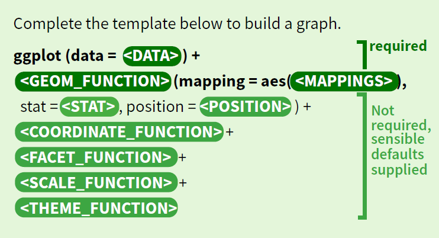

class: inverse, middle 
### Datenanalyse mit R
# # 9 Visualisierung Einzelvariablen
### Tobias Wiß, Carmen Walenta und Felix Wohlgemuth
### 02.05.2020

---
class: inverse, middle
## Wiederholung
# Visualisierungen mit ggplot2
---
# ggplot2 - Syntax
Um einen besser Überblick über die unterschiedlichen Bausteine von ggplot2 zu bekommen, öffnen Sie das ggplot2 cheatsheet https://github.com/rstudio/cheatsheets/blob/master/data-visualization-2.1.pdf 

```{r ggplot2 syntax, echo=FALSE, out.width = "80%", fig.align='center'}

```
---
# ggplot2 - Syntax
1. In `ggplot()` Daten definieren (optional auch `aes()` falls Variablen für alle `geom_functions` gleich bleiben):  
`ggplot(data = <DATAFRAMENAMEN>)`

2. Die gewünschte `geom_function` als zweite Ebene per `+` definieren (zB `geom_line()`):  
`geom_line(mapping = aes(<MAPPINGS>))`

3. In den aesthetics `aes()` die Variablen definieren:  
`geom_line(mapping = aes(x = <X-ACHSE>, y = <Y-ACHSE>, colour = <GRUPPIERUNGSVARIABLE>))`

4. Aussehen des Plots außerhalb von `aes()` definieren: zB Linienstärke mit `size = 2`

4. optional per `+` eine weitere `geom_function` hinzufügen oder das Aussehen der Grafik bearbeiten (zB mit `labs()` die Achsen beschriften und Titel festlegen)

5. optional ein fertiges theme anwenden oder selbst erstellen  
(Überblick: https://ggplot2.tidyverse.org/reference/ggtheme.html)
---
```{r ggplot 1a, eval=FALSE}
# load packages & import data
library(tidyverse)
socx_data <- read_csv("_raw/SOCX_AGG_20042020191205895.csv")

# visualisations with ggplot2
socx_data %>% 
  filter(COUNTRY %in% c("AUS", "FIN", "FRA", "CZE")) %>% 
# define data with %>%
  ggplot() + 
# define geom_function of choice
  geom_line(aes(x = YEAR, # define variable on x-axis
                y = family_cash_leave_pct_gdp,# define variable on y-axis
                colour = COUNTRY), # define grouping variable
            size = 2) + # set strength of lines
# set title
  labs(title = "öffentliche Ausgaben für Karenz im Zeitraum 2000 - 2015",
# set subtitle
       subtitle = "Österreich, Tschechien, Finnland und Frankreich im Vergleich",
# set name of x-axis       
       x = "Jahre", 
# set name of y-axis
       y = "öffentl. Ausgaben für Karenz (% BIP)", 
# set name of legend
       colour = "Länder") + 
# apply predefined theme
  theme_minimal() 
```
```{r ggplot 1b, include=FALSE}
library(tidyverse)
socx_data <- read_csv("_raw/SOCX_AGG_20042020191205895.csv")
```
---
# ggplot2 - Syntax
```{r ggplot 1c, fig.height=8, fig.width=12, fig.align='center', echo=FALSE}
socx_data %>% 
  filter(COUNTRY %in% c("AUS", "FIN", "FRA", "CZE")) %>% 
  ggplot() +
  geom_line(aes(x = YEAR, y = family_cash_leave_pct_gdp, colour = COUNTRY), size = 2) + 
  labs(title = "öffentliche Ausgaben für Karenz im Zeitraum 2000 - 2015", 
       subtitle = "Österreich, Tschechien, Finnland und Frankreich im Vergleich",
       x = "Jahre",
       y = "öffentl. Ausgaben für Karenz (% BIP)",
       colour = "Länder") +
  theme_minimal()
```
---
class: center, middle
Falls Sie noch Fragen haben, nutzen Sie das **Forum** auf moodle und unterstützen Sie Ihre Kolleg*innen mit Ihrem Wissen!  


Nutzen Sie auch unsere **R Sprechstunde**.  
Jeden Donnerstag von 11:00 bis 11:45 auf zoom oder im Anschluss an die zoom-Sitzung zu Familienpolitik (Link finden Sie auf moodle).
---
class: inverse, middle
## Einschub
# Daten unformen: langes vs. breites Format
Falls Sie es interessiert, wenn nicht springen Sie direkt zu Folie 24. Ab dort geht es um die Visualisierung von Einzelvariablen.
---
# langes vs. breites Format
Wenn Sie Daten der OECD oder Eurostat herunterladen, haben diese meistens kein tidy-data-Format. 

Für unsere Analysen benötigen wir aber meistens tidy data, wo jede Spalte eine eigene Variable ist und jede Zeile eine Beobachtung. 
```{r tidy, echo = FALSE, out.width = "90%", fig.pos= 'h'}
knitr::include_graphics("figures/tidy-1.png ")
```
`gather()` und `spread()` aus dem `tidyr`-Paket des `tidyverse` wandeln die Daten vom langen zum breiten Format und andersherum um.

*Ausführliches Tutorial: http://ohi-science.org/data-science-training/tidyr.html*


.footnote[Grafik: https://r4ds.had.co.nz/tidy-data.html]
---
# breites Format
Zuerst laden wir Daten und laden `tidyverse`. Die eurostat-Daten können zB im Excel-Format heruntergeladen werden, deshalb brauch wir `readxl` und müssen einige zusätzlich Optionen definieren.
```{r wide 1a,eval=FALSE}
library(tidyverse)
library(readxl)
data_care_Y3_M30 <- read_excel("_raw/ilc_caindformal-1_excelData.xlsx", 
    sheet = "Data3", range = "A10:O38", na = ":")
```
```{r wide 1b,include=FALSE}
library(tidyverse)
library(readxl)
data_care_Y3_M30 <- read_excel("_raw/ilc_caindformal-1_excelData.xlsx", 
    sheet = "Data3", range = "A10:O38", na = ":")
```
Die Daten des Excel-Sheets "Data3" zeigen den Anteil der Kinder unter 3 Jahren die 30 Stunden oder mehr in formaler Kinderbetreuung sind. 

Der Datensatz besteht aus 15 Variablen:
* Ländernamen
* Jahre 2005 bis 2018

*Andere Altersgruppen und Betreuungszeiten sind auf den anderen Sheets. Jedes Sheet beinhaltet aber nur eine Variable (zusätzlich zu Länder und Jahre).*
---
# breites Format
```{r wide 2, echo = FALSE}
DT::datatable(data_care_Y3_M30, options = list(pageLength = 7))
```
---
# breites Format umformen - gather()
Das Problem mit den Daten ist, dass wir die Jahre als eigene Variable benötigen und dass die Werte unserer Variable über 14 Jahresvariablen verteilt sind.

Wir müssen den Datensatz so umwandeln, dass wir drei Variablen haben: COUNTRY, YEAR und care_Y3_M30. 

Wir machen aus dem breiten Format ein langes Format, dafür nutzen wir `gather()` (macht den Datensatz schmäler).
```{r gather 1}
data_care_Y3_M30 <- gather(data_care_Y3_M30, # define data
                           "2005":"2018",    # set columns for transformation
                           key = "YEAR",     # new variable name for key (years)
                           value = "care_Y3_M30") %>%  # new variable name for values
  rename(COUNTRY = "GEO/TIME") # not necessary: rename country variable
```

*Das passende Cheatsheet zu `gather()` und `spread()` Seite 2 https://github.com/rstudio/cheatsheets/blob/master/data-import.pdf* 
---
# breites Format umformen - gather()
**Syntax von `gather()`:**
1. Die Daten definieren `data_care_Y3_M30` (`%>%` funktioniert auch).

2. Die Spalten bennen in denen sich die Werte befinden. Entweder jede Spalte einzeln oder `"2005":"2018"`, d.h. von der Spalte "2005" bis zur Spalte "2018".

3. Den Variablennamen definieren in denen die Namen der vorherigen Spalten gespeichert werden (also 2005 bis 2018) mit `key = "YEAR"`.

4. Den Variablennamen definieren in denen die Werte gespeichert werden mit `value = "care_Y3_M30"`

Unabhängig von `gather()` haben wir im letzten Schritt `GEOM/TIME` in `COUNTRY` umbenannt. Da wir die Ländervariable in `gather()` nicht erwähnt haben, wird sie einfach mitkopiert und nicht verändert.
---
# breites Format umformen - gather()
```{r gather 2, echo = FALSE}
DT::datatable(data_care_Y3_M30, options = list(pageLength = 7), rownames = FALSE)
```
---
# langes Format
* Der resultierende Dataframe ist im tidy-Format und im langen (long) Format.
* Der ursprüngliche dataframe hatte mehr Spalten. 
* Der umgewandelte dataframe hat jetzt mehr Zeilen. 

** Jetzt sieht der dataframe so aus wie wir es gewohnt sind und kann für alle bisher gelernten Funktionen verwendet werden.**

*Übersicht (Werte aus einem anderen Beispiel)* 
```{r gather 3, echo = FALSE, out.width = "90%", fig.pos= 'h'}
knitr::include_graphics("figures/tidy-widetolong.png ")
```

.footnote[Grafik: https://r4ds.had.co.nz/tidy-data.html]
---
# langes Format
OECD oder eurostat Daten können aber auch im langen Format herunter geladen werden. Das passiert meistens wenn man mehrere Variablen auswählt und diese im `.csv` Format bezieht. 

Die gleichen Daten zum Anteil der Kinder in formaler Kinbetreuung mit allen Untergliederungen nach Altersgruppen und nach Betreuungszeiten können in einer Datei ohne mehrere Excel-Sheets heruntergeladen werden. 
```{r long 1,eval=FALSE}
data_care_age_hours <- read_csv("_raw/ilc_caindformal_1_csvData.csv", na = ":") %>% 
  select(-"Flag and Footnotes")
```
```{r long 1a,include=FALSE}
data_care_age_hours <- read_csv("_raw/ilc_caindformal_1_csvData.csv", na = ":") %>% 
  select(-"Flag and Footnotes")
```
*Für die Spalte `Flag and Footnotes` kommen einige Fehler beim Einlesen. Da sie nicht essentiell ist, löschen wir sie vom dataframe. Flags und Footnotes sollten nicht ignoriert werden, aber den besten Überblick bekommt man, wenn man sich die Einträge auf der eurostat Homepage anschaut. Die neuesten Werte waren zB nur geschätzt, deshalb habe ich sie für den Download nicht ausgewählt.*
---
# langes Format
Die Daten sind zwar in einem langen Format, aber die Untergliederungen sind auf mehrere Variablen aufgeteilt (`AGE` und `DURATION`) und alle Werte sind in der Spalte `Value`. 

Altersgruppen `AGE`:
* `Y_LTE3` Jünger als 3 Jahre
* `Y3-CSA` 3 bis Schulalter
* `CSA-Y12` Schulalter bis 12 Jahre

Betreuungszeiten `DURATION`:
* `HO` Null Stunden
* `H1-29` 1 bis 29 Stunden
* `H_GE30` 30 Stunden und mehr

Das ist kein tidy Dataset, den wir so verwenden können.

---
# langes Format
```{r long 2, echo = FALSE}
DT::datatable(data_care_age_hours, options = list(pageLength = 7), rownames = FALSE)
```
---
# langes Format umformen - spread()
Wir müssen eine Spalte schaffen die alle Variablennamen beinhaltet. Im nächsten Schritt müssen die Werte aus `Value` auf die Variablen verteilt werden. Das geht mit `spread()`, damit machen wir den dataframe breiter.

Nach der Umwandlung haben wir mehrere Variablen: `GEO`, `TIME`  und alle Kombination von `AGE` & `DURATION` in eigenen Variablen.

Zuerst erstellen wir mit `mutate()` und `paste()` eine neue Variable, die einfach die Werte von `AGE` und `DURATION` mit `_` zusammenklebt. Dann löschen wir `AGE` und `DURATION` weil wir sie nicht mehr benötigen.
```{r paste}
data_care_age_hours <- data_care_age_hours %>%
                                 # data defined per %>% 
  mutate(var_names =             # new variable "var_names"
           paste(AGE, DURATION,  # set variables for composition
                 sep = "_")) %>% # spaceholder between values
  select(-AGE, -DURATION)        # delete AGE and DURATION variables
```
---
# langes Format umformen - spread()
```{r paste 2, echo = FALSE}
DT::datatable(data_care_age_hours, options = list(pageLength = 7), rownames = FALSE)
```
---
# langes Format umformen - spread()
Jetzt haben wir das Format, dass wir für `spread()` benötigen.
```{r spread}
data_care_age_hours <- data_care_age_hours %>% # data defined per %>% 
  spread(key = "var_names", # set variable containing names of new variables
         value = "Value")   # set variable containing values of new variables
```
**Syntax von `spread()`:**
1. Das dataframe definieren, hier per `%>%` (kann auch direkt in `spread()` an erster Stelle gemacht werden).
2. Per `key = "var_names"` die Variable definieren, welche die neuen Variablennamen beinhaltet.
3. Per `value = "Value"` die Variable definieren, welche die Werte der neuen Variablen beinhaltet.

*Wir haben `AGE` und `DURATION` schon gelöscht, aber per `-AGE` und `-DURATION` in `spread()` hätten wir auch die Spalten löschen können. Alle nicht genannten Spalten also `GEO` und `TIME` werden kopiert.*
---
# langes tidy Format
```{r spread 2, echo = FALSE}
DT::datatable(data_care_age_hours, options = list(pageLength = 7), rownames = FALSE)
```
---
# langes tidy Format
Jetzt haben wie ein dataframe zum Anteil der Kinder unterschiedlicher Altersgruppen (3 Gruppen) in formaler Kinderbetreuung nach Betreuungszeiten (3 Gruppen). 

* Daher haben wir 9 neue Variablen mit allen Kombination von Altersgruppen und Betreuungszeiten.
* Zusätzlich haben wir die `GEO` Variable mit den Ländernamen und `TIME` mit den Jahren.

Am besten wir benennen die Variablen noch um, so dass die Namen besser zum Inhalt passen: 
* Sie können mit `rename(neuer Name = alter Name)` Variablennamen wählen die für Sie am verständlichsten sind. 
* Wir hätten die Umbenennung auch vor `spread()` machen können als die Betreuungszeiten und Altergsruppen noch Werte waren. Das funktioniert mit `recode(variablennamen, alter Wert = neuer Wert)`. Nach `paste()` und `spread()` sind die Werte dann Variablennamen.
---
class: inverse, middle
# Visualisierung Einzelvariablen
---
# World Value Survey Daten aufbereiten
Die WVS-Zeitreihedaten von 1981 bis 2016 finden Sie auf http://www.worldvaluessurvey.org/WVSDocumentationWVL.jsp 

WVS stellt die Daten im .RDS-Format zu Verfügung - Einlesen ist daher keine Problem.

Der Datensatz beinhaltet die Antworten von Einzelpersonen aus 113 Länder für 6 Wellen, daher besteht er aus 50.779 Beobachtungen (Zeilen) und 1.261 Variablen - **der Datensatz ist riesig**.

Für den Kurs werden wir den Datensatz auf ein Befragungswelle (wave 6), zwei Länder (DEU, SWE) und wenige Variablen reduzieren (den reduzierten Datensatz finde Sie auf moodle).

*Leider ist Österreich nicht im WVS-Datensatz.*

Im Codebook finden Sie die Beschreibung für jede Variablen.

---
# World Value Survey Daten aufbereiten

Für unsere Einheit hab ich folgende Variablen ausgewählt:
* `S003`: country/region
* `S007`: unified respondent number ID
* `S017`: weight
* `S019`: equilibrated weight-1500
* `X001`: sex/gender
* `X003`: age
* `X007`: maritial status
* `X011`: How many children do you have?
* `X025A`: Highest educational level attained
* `X047`: Scale of incomes
* `C001`: Jobs scarce: Men should have more right to a job than women 
* `D057`: Being a housewife just as fulfilling
* `D063`: Job best way for women to be independent(b)
---
# WVS Datensatz reduzieren
* Für die Datenmanipulation und die Visualisierung benötigen wir Pakete aus dem tidyverse.

* Alle Werte zischen [-99, -1] im WVS sind fehlende Werte (Im Codebook werden die genauen Inhalte der unterschiedlichen fehlende Werte erläutert).

* Deshalb brauchen wir `replace_with_na_all()` aus dem `naniar` Paket (Mehr Infos: https://cran.r-project.org/web/packages/naniar/vignettes/replace-with-na.html).
---
# WVS Datensatz reduzieren
```{r wvs data}
# load packages & import data
wvs_data <- readRDS("_raw/F00008390-WVS_Longitudinal_1981_2016_r_v20180912.RDS")
library(tidyverse)
library(naniar)
# filter countries & wave
wvs_data <- wvs_data %>% 
  filter(S003 %in% c("276", "752") & S002 == 6) %>%
  select(S003, S007, S017, S019, 
         X001, X003, X007, X011, X025A, X047,
         C001, D057, D063_B) %>% 
  mutate(S003 = recode(S003, "276" = "DEU", "752" = "SWE")) %>%
  replace_with_na_all(condition = ~.x <= -1) 
# all values equal and smaller than -1 are defined as NA for all variables
saveRDS(wvs_data, file = "data/wvs_short.RDS")
# optional save new data set
```
---
# Verteilung von Einzelvariablen visualisieren
Für die Visualisierung von Einzelvariablen verwenden wir die Variable `C001` *Jobs scarce: Men should have more right to a job than women*:
* 1:Agree
* 2:Disagree
* 3:Neither
* -5:Missing; Unknown
* -4:Not asked in survey
* -3:Not applicable
* -2:No answer
* -1:Don´t know
---
# Balkendiagram geom_bar
Die `geom_function` für ein Balkendiagramm ist `geom_bar()`. Da wir nur eine Variable darstellen, können wir entweder `aes(x = C001)` oder `aes(y = C001)` verwenden (auf welcher Achse die Balken angezeigt werden sollen).
```{r geom_bar1, eval=FALSE}
wvs_data %>%
  filter(S003 == "DEU") %>% 
  ggplot(aes(x = C001)) + 
  geom_bar()
```
**Syntax:**
* `filter()` um Daten für Deutschland auszuwählen.
* `ggplot()` Daten werden per %>% definert, somit haben wir die gefilterten Beobachtugen.
* `ggplot(aes(x = C001))` Variable für die x-Achse kann direkt in `ggplot()` aber auch in `geom_bar()` festgelegt werden. `aes()` nicht vergessen!

Fehlermeldung bedeutet, dass 11 Beobachtungen entfernt wurden, weil sie fehlende Werte haben. 
---
```{r geom_bar2, echo=FALSE}
wvs_data %>%
  filter(S003 == "DEU") %>% 
  ggplot(aes(x = C001)) +
  geom_bar()
```
---
# Index erstellen
Für die Verwendung eines Histogramms benötigen wir eine kontinuierliche numerische Variable. Leider gibt es im WVS nur wenige numerische Variablen, da die meisten Surveyfragen mit einer Likert-Skala oder einer Nominal-Skala beantwortet werden. 

Daher bilden wir einen Index aus den unterschiedlichen Variablen zur Einstellung bezüglich der Erwerbsarbeit von Frauen. 
* Vor der Bildung des Indexes standardisieren wir die Teilvariablen mit `scale()`. 
* Die neuen Werte sind die Abweichung vom Mittelwert relativ zur Standardabweichung. Der Mittelwert der transformierten Variablen ist nun 0 und die Standardabweichnung 1.
* Die Bildung des Index ist simple: Wir addieren die einzelnen Teilvariablen und ziehen die Werte von `D063_B` ab, da die Antworten nicht in die gleiche Aussagerichtung gehen. 

Umso negativer der Wert des Indexes umso mehr stimmen die Leute zu, dass Frauen Hausfrauen sein sollen, Männer auf dem Arbeitsmarkt einen Vorzug haben sollen und dass ein Beruf die Unabhängigkeit von Frauen **nicht** fördert (Variablenwerte umgedreht für `D063_B`, weil wir sie abziehen von den anderen).
---
# Index erstellen
```{r index}
wvs_data_scale <- wvs_data %>% 
  # index creation for each country separately 
  group_by(S003) %>% 
  # answer "neither" transformed to NA
  replace_with_na(replace = list(C001 = 3)) %>% 
  # standardise each variable
  mutate(C001 = scale(C001)) %>% 
  mutate(D057 = scale(D057)) %>% 
  mutate(D063_B = scale(D063_B)) %>%
  # ungrouping probably not necessary
  ungroup() %>% 
  # create women_index variable
  mutate(women_index = C001 + D057 - D063_B)
```
---
# Histogramm geom_histogram
Histogramm für unsere neue Indexvariable zur Einstellung bezüglicher der Erwerbsarbeit von Frauen. Wir zeigen nur die Antworten aus Deutschland.
```{r geom hist1, eval=FALSE}
wvs_data_scale %>%
  filter(S003 == "DEU") %>%
  ggplot(aes(x = women_index)) +
  geom_histogram()
```
Die Syntax ist fast gleich wie beim Balkendiagramm. Anstelle von `geom_bar()` nehmen wir `geom_histogram()`. 
---
```{r geom hist2, echo=FALSE}
wvs_data_scale %>%
  filter(S003 == "DEU") %>%
  ggplot(aes(x = women_index)) +
  geom_histogram()
```
---
# Histogramm geom_histogram
Das Ziel eines Histogrammes ist die Verteilung einer Variable darzustellen aber auch die Komplexität zu reduzieren. 

R wählt die Säulenbreite und damit die Anzahl der Säulen automatisch. Wir können diese aber auch manuell festlegen mit `binwidth = Säulenbreite in Einheit der Variable` und somit die Komplexität reduzieren. 

Wir wählen `binwidth = 1`, somit eine Standardabweichung.
```{r geom hist3, eval=FALSE}
wvs_data_scale %>%
  filter(S003 == "DEU") %>%
  ggplot(aes(x = women_index)) +
  geom_histogram(binwidth = 1) # bin width 1 standard deviation
```
---
```{r geom hist4, echo=FALSE}
wvs_data_scale %>%
  filter(S003 == "DEU") %>%
  ggplot(aes(x = women_index)) +
  geom_histogram(binwidth = 1) # Säulenbreite ist eine 1 Standardabweichung
```
---
# Visualisierung Dichteplots geom_density
Für Dichteplots gilt das gleiche wie für Histogramme: Sie sind am besten für kontinuierliche numerische Variablen geeignet. Daher nehmen wir unsere neue Indexvariable.
```{r density1, eval=FALSE}
wvs_data_scale %>%
  filter(S003 == "SWE") %>% # data for Sweden
  ggplot(aes(x = women_index)) +
  geom_density()
```
Syntax bleibt gleich, nur das wir `geom_density()` verwenden.
---
```{r density2, echo=FALSE}
wvs_data_scale %>%
  filter(S003 == "SWE") %>% 
  ggplot(aes(x = women_index)) +
  geom_density()
```
---
# Boxplots
Die Verteilung der Indexvariable je Land könen wir mit einem Boxplot vergleichen.
```{r boxplot1, eval=FALSE}
wvs_data_scale %>% 
  ggplot(aes(x = women_index, 
             y = S003)) + # y-axis: "DEU" & "SWE"
  geom_boxplot()
```
Da wir für die y-Achse die Ländervariable `S003` festlegen, bekommen wir je ein Boxplot pro Land. 
---
```{r boxplot2, echo=FALSE}
wvs_data_scale %>% 
  ggplot(aes(x = women_index, y = S003)) +
  geom_boxplot()
```
---
# Plots je Gruppe (Länder)
Letzte Woche haben wir gelernt, dass wir per `colour = ` oder auch `shape = ` Daten für unterschiedliche Gruppen anzeigen können. 

Mit `facet_grid()` können wir in einer Visualisierung je Gruppe einen Plot getrennt erstellen. ZB für Frauen und Männer getrennt (Reihe) sowie für Deutschland und Schweden (Spalten).
```{r facet_grid1, eval=FALSE}
wvs_data_scale %>%
  ggplot(aes(x = women_index)) +
  geom_histogram(binwidth = 1) +
  facet_grid(cols = vars(S003), # "SWE" & "DEU" in separate columns
             rows =vars(X001))  # men and women in separate rows
```
`facet_grid()` ist mit fast allen `geom_functions` kompatibel.

*Es muss nicht beides `cols =` und `rows =` angeben werden. Es reicht auch, wenn nur eins von beiden verwendet wird. Probieren Sie es einfach aus.* 
---
```{r facet_grid2, echo=FALSE}
wvs_data_scale %>%
  ggplot(aes(x = women_index)) +
  geom_histogram(binwidth = 1) +
  facet_grid(cols = vars(S003), 
             rows =vars(X001))
```

*Schauen Sie im Codebook nach wie 1 und 2 für `X001` definiert sind* 
---
# Plots speichern ggsave()
Plots könne direkt im Vorschaufenster gespeichert werden. Einfach auf *Export* > *Save as image* klicken. Im neuen Fenster können Sie die Größe der Grafik, Dateinamen und Speicherort angeben.

Das Gleiche können Sie auch mit dem Befehl `ggsave()` machen:
* Falls kein Objektnamen angegeben wird, speichert `ggsave()` immer den zuletzt erstellten Plot.
* Den Dateinnamen mit Dateiendung angeben. `filename` steht an erster Position in `ggsave()`.
* R speichert wie immer in der Working Directory. Per `path = ` kann der genau Dateipfad angegeben werden, wenn nicht dann wird direkt in der Working directory gespeichert.
* Falls keine Größe angeben wird, wird automatisch die passende Größe ausgewählt.
* Per `width = ` und `height = ` kann das überschrieben werden (R wählt die Größeneinheit des Systems, diese kann per `units = c("in", "cm", "mm")` und `dpi = ` überschrieben werden).
```{r ggsave, eval = FALSE}
ggsave("women_index.png", path = "figures", width = 5, height = 5)
```
---
# Übung 9
* Laden Sie sich den reduzierten WVS Datensatz `wvs_short.RDS` von moodle herunter.

* *Optional: Verwenden Sie den ursprünglichen Datensatz direkt von WVS und reduzieren Sie den Datensatz nach Ihren Wünschen (Länder, Welle, Variablen und fehlende Werte definieren).*

* erstellen Sie ein Boxplot für eine Variable Ihrer Wahl, entweder für Deutschland oder Schweden (oder selbstgewählte Länder).

* Erstellen Sie Boxplots für Schweden und Deutschland und Männer und Frauen (andere Variable nach Wahl) in einer Grafik mit `facet_grid()`.

* Laden Sie Ihr Skript und die Grafiken als .png bis zum 8. Mai 12:00 auf moodle hoch.

*Optional: Falls Sie `gather()` und `spread()` testen wollen, dann schicken Sie mir Ihr Skript per Mail und ich gebe Ihnen gerne Feedback.*
---
class: center, middle
Falls Sie noch Fragen haben, nutzen Sie das **Forum** auf moodle und unterstützen Sie Ihre Kolleg*innen mit Ihrem Wissen!  


Nutzen Sie auch unsere **R Sprechstunde**.  
Jeden Donnerstag von 11:00 bis 11:45 auf zoom oder im Anschluss an die zoom-Sitzung zu Familienpolitik (Link finden Sie auf moodle).
